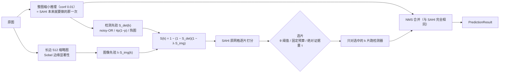

# Glance-SAHI 设计报告：先扫一眼全图，只切可疑区域

> 场景：高清 / 航拍图里找小目标（人、车，可扩展到烟头、火点、违停）
> 基线开源项目：[obss/sahi](https://github.com/obss/sahi) 0.12.7（切片推理）+ [ultralytics](https://github.com/ultralytics/ultralytics) YOLO11s
> **检测器有两种配置**：零训练 COCO 预训练（3.2–3.17 的主结果）与 **VisDrone 训练集微调**的 `yolo11s-visdrone-ft.pt`（3.18–3.23，数据集名 `visdrone_ft`）。前者是为了把"选片策略"这一个变量隔离干净（同检测器才可归因），后者是为了回答"结论是否只成立于检测器没见过这类场景"。
> **我们自己训练 / 拟合出来的模型**：① VisDrone 切片辅助微调检测器（3.20）；② **可学习稀疏路由器**，在三个配置上各训一次——VisDrone（3.15）、DOTA（3.17）、VisDrone-ft（3.21），均带 5 折交叉验证与留出评测；③ **保序回归标定器**（3.12）；④ 分辨率路由的岭回归（3.18，负结果）。详见 4.6「我们到底训练了什么」。
> 数据集：[VisDrone2019-DET-val](https://github.com/VisDrone/VisDrone-Dataset)（548 张无人机航拍图，1360×765 ~ 2000×1500，评测用）；[VisDrone2019-DET-train](https://github.com/VisDrone/VisDrone-Dataset)（微调用）；[DOTA-v1.0 val](https://captain-whu.github.io/DOTA/)（458 张大幅面遥感图，ultralytics 转换版 `DOTAv1.zip`）
> 硬件：RTX 3050 Laptop 4GB（评测）；RTX 4070 Laptop（微调训练，3.20）
> 报告里所有数字都来自 `results/*.csv`、`results/visdrone_ft/*.csv`、`results/dota/*.csv` 与 `results/dota15/*.csv`，由 `scripts/` 下的脚本生成，可复现。**预注册与分批落地的结果另见 `docs/PREREG-*.md` 与 `docs/RESULTS-*.md`**（先写预测、后跑实验）。

主线：**为什么改 → 改了什么 → 结果如何 → 有什么价值**。

---

## 1. 为什么改

### 1.1 SAHI 做了什么

小目标在整图推理时会被缩没：一张 1920×1080 的航拍图送进 640 输入的 YOLO，要缩小 3 倍，一个 20×20 像素的行人只剩 7×7，基本检测不到。SAHI 的办法是把原图切成 512×512、重叠 20% 的切片，每片单独送进检测器（相当于放大 1.25 倍看），最后把各片结果平移回原图坐标，和一次整图推理（standard prediction，负责大目标）一起做 NMS 合并。

### 1.2 瓶颈：切片数只和图像尺寸有关，和图里有没有东西无关

`sahi.slicing.get_slice_bboxes` 是一个纯几何的双重循环，切片数 N ≈ ⌈W/410⌉·⌈H/410⌉：

| 分辨率 | SAHI 切片数（512，重叠 0.2） | 检测器调用次数（含整图） |
|---|---|---|
| 1360×765 | 8 | 9 |
| 1920×1080 | 15 | 16 |
| 3840×2160（4K） | 60 | 61 |
| 7680×4320（8K） | 209 | 210 |

检测器调用次数随像素面积线性增长，对航拍图来说大量切片落在天空、屋顶、农田、空旷路面上，**这些切片推理完什么都不产出，算力白花了**。

实测（VisDrone-val，`run_eval.py sim` 输出）：SAHI 的 4275 个切片中，**不含任何 person/vehicle 真值目标中心的切片有 305 个，占 7.1%**；只看小目标（< 32²），不含小目标的切片占 23.8%（Oracle 只需 76.2% 的切片就能覆盖全部小目标）。VisDrone 是城市街道场景、平均每张图 57 个目标，已经是对我们最不利的情况；在大幅面遥感图（DOTA，见 3.7）上，这个比例会高得多。

### 1.3 灵感

人眼只有视线正中约 2° 是清楚的，外周是模糊的。我们不会把视野逐格看清，而是先粗看全局，看到"那里好像有东西"再把视线跳过去（扫视）。本项目把这套思路落到 SAHI 上：**先用缩小的整图"扫一眼"，再只对可疑区域切片放大看**。

---

## 2. 改了什么

### 2.1 流程对比



（上图是 mermaid 纯文本，可 diff、可版本管理；SAHI 侧对应“生成 N 片 → N 片逐一推理 → 整图推理一次 → NMS 合并”。）

关键设计：**只改“选哪些切片”，其余一律复用 SAHI**。切片网格用 `sahi.slicing.get_slice_bboxes`，单片推理用 `sahi.predict.get_prediction(shift_amount, full_shape)`，合并用 `sahi.predict.POSTPROCESS_NAME_TO_CLASS`。因此：
- 阈值 θ = 0（全选）时，结果与官方 `get_sliced_prediction` 逐框一致（`run_eval.py e2e --check-all` 自检）；
- 返回的是 SAHI 原生的 `PredictionResult`，下游可视化、导出、COCO 评测代码不用改；
- 对检测器没有任何要求，换成 RT-DETR、换成自己训练的 VisDrone 模型都能直接用。

### 2.2 切片打分

对第 k 个切片 R_k 计算一个“这里值得细看”的分数 S_k ∈ [0, 1]，由两路证据组成（`glance_sahi/saliency.py`）。

**检测先验（主证据）**。扫视阶段整图推理在低阈值（0.01）下给出一批粗检测，每个检测 j 的置信度 c_j 可近似看作“这个位置有目标”的概率。切片里“至少有一个目标”的概率按 noisy-OR 计算：

    S_det(k) = 1 − Π_{j: 中心 ∈ R_k ⊕ margin} (1 − c_j)

- 为什么放低阈值：缩小后的小目标置信度通常只有 0.01–0.1，作为最终输出是误检，但作为“这里可能有东西”的线索很有价值；
- 为什么用 noisy-OR 而不是取最大：一个 0.3 的框和二十个 0.05 的框（密集的小人群）应该都能触发细看，noisy-OR 能累积弱证据（1 − 0.95²⁰ ≈ 0.64）；
- margin = 16 像素：目标中心落在切片边缘附近时也算，配合 SAHI 的 20% 重叠。

**形式化：S_det 就是“切片含目标”的后验概率。** 记第 k 片是否含目标的指示变量 Y_k ∈ {0,1}，把扫视阶段的每个粗检测 j 看成一次独立观测 E_j，其可靠度 P(E_j | 该处有目标) ≈ c_j，无目标处的误报率在同一尺度下近似为 0，则

    S_det(k) = P(Y_k = 1 | E_{1..m}) = 1 − Π_{j ∈ J_k} (1 − c_j),   J_k = { j : 中心_j ∈ R_k ⊕ margin }

这是把概率陈述直接搬进模型：**θ 不是启发式加权拍出来的阈值，而是后验概率阈值**；扫 θ 得到的不是一条曲线，而是一族“速度-精度”工作点（论文主图，图 1、图 2）。“图越大越省”也因此有了可检验的表述：空切片比例上升 ⟹ 同一 θ 下 k/N 下降（VisDrone 7.1% 空切片、DOTA 82.1%，见 3.7）。两点假设需要说明：一是各证据近似独立（重叠框会重复计数，但 NMS 后同一目标只留一个框）；二是 c_j 只在序关系上可靠（检测器未在缩略图尺度上标定），因此用相对阈值 θ 而非绝对判据。

**证据强度 w_j 的四种取法（打分函数消融，`det_weights`）。**

| 变体 | 片内证据强度 w_j | 聚合方式 | 直觉 / 代价 | 配置 |
|---|---|---|---|---|
| v0（反面消融） | c_j | 取最大 | “最像目标的那个框说了算”，置信度越高越热；密集区域被压平 | `det_prior="max"` |
| 不确定度加权 | 4c_j(1−c_j) | noisy-OR | c ≈ 0.5 的“似是而非”框最热，整图已看清的地方变冷 | `det_prior="uncertain"` |
| **本文（默认）** | c_j | noisy-OR | 弱证据可累积，c_j 直接就是概率 | `det_prior="noisyor"` |
| 热图 | c_j（按高斯软扩散） | 1 − exp(−Σ heat) | O(像素) 一次卷积、无硬边界、分数是绝对量 | `det_prior="heatmap"` |

四种取法共用一个接口，可在一份缓存上离线对比（`run_eval.py sim` 的 `ABLATIONS`）；设计动机和参照数据见 3.8，热图与绝对量 τ 的形式化见 3.9，曲线图 `results/figures/fig6_det_weights.png` 由 `make_figures.py` 生成。

**图像先验（兜底证据）**。缩小后检测器完全没反应的极小目标，在缩略图上往往仍然表现为局部高频纹理。在长边 512 的灰度缩略图上计算：

    mag = |∇I|（Sobel）,  sal = max(blur₅(mag) − blur₃₁(mag), 0) + 0.5·blur₅(mag)

前一项是“比周围更杂”（抑制大片均匀纹理如草地、屋顶），后一项是“本身就杂”。按全图 5%/99% 分位归一化到 [0,1]，切片内取 95 分位得到 S_img(k)。另实现了谱残差显著性（Hou & Zhang, 2007）作消融对比。

**融合**（同样是 noisy-OR，λ 为图像先验的可信度）：

    S(k) = 1 − (1 − S_det(k)) · (1 − λ·S_img(k)),   λ = 0.3

**选片**：只有分数够高的切片才做高清推理（`glance_sahi/selector.py`），三种规则对应两个旋钮：

- `mode="threshold"`：S(k) ≥ θ。θ 作用在 [0,1] 的相对分数上，扫 θ 得到一族速度-精度工作点（本文默认）；
- `mode="budget"`：固定保留分数最高的 x%（部署时怕超时的兜底）；
- `mode="evidence"`：片内**绝对**证据量 Σc_j ≥ τ。它不需要任何归一化，因此可跨图、甚至跨数据集统一标定，不受 λ 改动导致整体漂移的影响（这正是 3.7 里 DOTA 上必须重标 λ 的那个痛点的正面解法）。

另有 `min_slices`：选中数不足时按分数补齐，避免“阈值一高一片不剩”的退化（默认 0 = 关闭，保持既有结果不变；`evidence` 模式自动至少保 1 片）。

### 2.3 成本

| 环节 | SAHI | Glance-SAHI |
|---|---|---|
| 整图推理 | 1 次 | 1 次（同一次，只是阈值更低） |
| 检测先验打分 | — | noisy-OR / 4p(1−p)：< 0.1 ms/图（逐片向量化，与框数、切片数几乎无关）；热图变体：一次卷积 |
| 图像先验打分 | — | 缩略图 Sobel + N 个切片求分位：实测 9.9 ms/图（CPU，未优化） |
| 切片推理 | N 次 | k 次（每片实测 23.6 ms，RTX 3050） |
| 合并 | NMS | NMS（输入更少，更快） |

也就是说，只要每图少跑 1 片（≈ 24 ms），就能抵消图像先验的开销（≈ 10 ms）；检测先验本身几乎零成本。

**每一行成本都单独计量进表**：`run_eval.py sim` 的 `sweep.csv` 里除了总耗时 `ms_per_img`，还有一列 `ms_extra` 只记“打分”这一步。图像先验在 DOTA 上是 10–36 ms/图的真实成本，进表比只在正文写一句更有说服力，也方便把“省下的推理”与“新增的打分”分开算账。

### 2.4 与已有工作的区别（不宣称首创“只切可疑区域”）

“先粗看、再只细看可疑区域”是航拍小目标检测里一条成熟的思路，下面的开源项目我们都逐个核对过仓库与论文（GitHub 链接均可访问）：

| 方法 | 年份/会议 | 代码 | 怎么决定细看哪里 | 额外训练？ | 我们借鉴了什么 / 区别在哪 |
|---|---|---|---|---|---|
| SAHI | ICIP 2022 | [obss/sahi](https://github.com/obss/sahi) | 均匀网格，全部切片 | 否 | **基线**。直接复用它的 `get_slice_bboxes` / `get_prediction` / 后处理，只在“生成切片”和“逐片推理”之间插入选片 |
| ClusDet | ICCV 2019 | [fyangneil/Clustered-Object-Detection-in-Aerial-Image](https://github.com/fyangneil/Clustered-Object-Detection-in-Aerial-Image) | 训练 CPNet 预测目标聚集区域 + ScaleNet 估尺度 | 是 | 证明“粗阶段找聚集区域”可行；我们用免训练的打分代替 CPNet |
| DMNet | CVPRW 2020 | [Cli98/DMNet](https://github.com/Cli98/DMNet) | 训练 MCNN 密度图，滑窗内密度求和 ≥ 阈值则裁剪 | 是 | 借鉴“窗口内证据累加再设阈值”，我们的 noisy-OR 分数相当于一张免训练的伪密度 |
| GLSAN | TIP 2021 | [dengsutao/glsan](https://github.com/dengsutao/glsan) | 全局粗检后，SARSA 按检测框聚类裁出密集区 | 裁剪本身无监督，检测/超分需训练 | 与我们最接近的“基于粗检测框选区域”，但它裁自由形状的区域、还要超分；我们固定在 SAHI 网格上选片，可直接替换 |
| QueryDet | CVPR 2022 | [ChenhongyiYang/QueryDet-PyTorch](https://github.com/ChenhongyiYang/QueryDet-PyTorch) | 低分辨率特征上预测小目标粗位置，只在对应高分辨率位置做稀疏检测 | 是 | “低分辨率一瞥引导高分辨率计算”的理论支撑；它在特征层做，我们在图像层做、对检测器零改动 |
| UFPMP-Det | AAAI 2022 | [PuAnysh/UFPMP-Det](https://github.com/PuAnysh/UFPMP-Det) | 粗检测器给前景区域，拼成马赛克图一次精检 | 是 | 后续可借鉴：把选中的切片拼图/打 batch 进一步降延迟 |
| CZDet | CVPRW 2023 | [akhilpm/DroneDetectron2](https://github.com/akhilpm/DroneDetectron2) | 把“密集裁剪框”当成新类别让检测器一起检出，再放大重检 | 是 | 同样在 VisDrone/DOTA 上验证两阶段级联 |
| YOLC | TITS 2024 | [dawn-ech/YOLC](https://github.com/dawn-ech/YOLC) | 热图上取 top-k 聚集区域放大 | 是 | 借鉴其“固定预算 top-k”——我们的 `mode="budget"` |
| ESOD | TIP 2024 | [alibaba/esod](https://github.com/alibaba/esod) | ObjSeeker 在特征图上找目标，AdaSlicer 丢背景块 | 是 | 借鉴其“空块率 / 漏检率”指标 → 我们的“空切片比例 / 小目标覆盖率” |
| GOIS | Neurocomputing 2025 | [MMUZAMMUL/GOIS](https://github.com/MMUZAMMUL/GOIS) | 粗切片扫一遍找 ROI，再在 ROI 上用更细切片精检 | 否 | 目标是**提精度**（多跑细切片）；我们目标是**省算力**（少跑切片），方向相反但可叠加 |
| ASAHI | Remote Sensing 2023 | 未找到官方代码 | 按分辨率自适应切片**数量**，仍是均匀覆盖 | 否 | 与内容无关，可与我们的按内容选片叠加 |
| ROI-Gated SAHI | arXiv 2608.23923（2026-08） | 论文未给出代码 | 另一个轻量检测器在 416 缩略图上出 ROI，只跑与 ROI 相交的切片；ROI 覆盖率高时回退全量 SAHI | 否 | **与本项目思路最接近的同期工作**，区别见下 |

**与 ROI-Gated SAHI 的区别**（它的论文在 COCO128 上报告：平均速度只有全量 SAHI 的 0.88×，mAP50 从 0.757 掉到 0.660；加自适应回退后也只有 1.02×）：

1. **不额外加模型**：它要一个单独的 proposer（YOLOv8n），多一次推理；我们的“扫视”就是 SAHI 本来就要做的整图推理（`perform_standard_pred`），只是把阈值放低，开销≈0；
2. **软打分而不是硬 ROI**：它把 proposer 的框 NMS 后扩 15% 当 ROI，只要和切片相交就跑；我们用 0.01 的极低阈值拿到所有弱响应，用 noisy-OR 累积成“切片里有目标的概率”，再用图像显著性兜底，θ 连续可调，自然覆盖“稀疏→密集”的全部区间，不需要单独的回退开关；
3. **评测更严格**：大规模航拍数据集（VisDrone 548 张、DOTA 458 张）、**同数量随机选片对照**、Oracle 上界、与官方 `get_sliced_prediction` 逐位一致的自检。在这套评测下，我们在同等精度下是真正更快的（见第 3 节），而不只在个别稀疏样例上更快。

我们的定位是工程上最轻的一种：不训练、不改检测器、不读模型内部、不加第二个模型，黑盒检测器即可，一行替换 `get_sliced_prediction`。

---

## 3. 结果如何

### 3.1 实验设置

- 检测器：YOLO11s COCO 预训练（未在 VisDrone 上训练），输入 640，输出阈值 0.05；
- 评测类别：person ← VisDrone 的 pedestrian + people；vehicle ← car + van + truck + bus（COCO 能对上的类别）；忽略区域和 others 记为 crowd，落在里面的检测不算误检；
- 指标：pycocotools COCO AP、AP50、AP_small（面积 < 32²，VisDrone 中 31009 个有效目标里 66.5% 是小目标），maxDets = 500；另记录“小目标覆盖率” = 中心落在被选切片内的小目标真值比例（解释漏检来自哪里）；
- 所有方法共用同一个检测器、同一套切片网格（512，重叠 0.2）、同一个后处理（NMS，IoU 0.5）；
- 为保证扫参可复现且公平，`run_eval.py cache` 对每张图只跑一遍“扫视 + 全部切片”并缓存每片结果与耗时；任何选片策略的结果 = 扫视结果 + 被选切片的结果 → 同一个 NMS，可离线精确复现。端到端真实计时另由 `run_eval.py e2e` 给出，并用来核对离线结果。

### 3.2 主结果（VisDrone2019-DET-val，548 张）

离线模拟（`results/sweep.csv`，同一份缓存，耗时 = 扫视 + 被选切片 + 打分 + NMS 的实测耗时之和）：

| 方法 | 切片数/图 | 相对 SAHI 切片 | ms/图 | AP | AP50 | AP_small | 小目标覆盖率 |
|---|---|---|---|---|---|---|---|
| 整图直接推理 | 0 | 0% | 44.8 | 20.03 | 34.87 | 9.30 | — |
| SAHI 均匀切片 | 7.80 | 100% | 215.0 | **28.40** | **48.95** | **17.88** | 100% |
| **Glance-SAHI（θ=0.9，默认工作点）** | 6.16 | **79.0%** | 189.6 | 28.27 | 48.69 | 17.75 | 95.8% |
| Glance-SAHI（θ=0.99，激进） | 4.90 | **62.9%** | 147.3 | 27.90 | 48.09 | 17.46 | 92.6% |
| Glance-SAHI 仅检测先验（θ=0.99） | 4.80 | 61.5% | 133.1 | 27.82 | 48.05 | 17.39 | 92.2% |
| 随机选同样数量切片（θ=0.9 对应，3 次均值） | 6.16 | 79.0% | 179.6 | 27.58 ± 0.05 | 47.54 | 16.96 ± 0.03 | 91.1% |
| 随机选同样数量切片（θ=0.99 对应） | 4.90 | 62.9% | 147.1 | 26.64 ± 0.06 | 46.37 | 16.03 ± 0.08 | 82.9% |
| Oracle（按真值小目标选片，上界，不可部署） | 5.95 | 76.2% | 177.1 | 28.54 | 49.50 | 18.15 | 100% |

端到端真实运行（`run_eval.py e2e --op 0.9 --check-all`，`results/e2e.csv`，真实调用官方 `get_sliced_prediction` 和我们的 `glance_sliced_prediction`）：

| 方法 | ms/图 | FPS | 切片数/图 | AP | AP_small |
|---|---|---|---|---|---|
| 整图 | 30.5 | 32.8 | 0 | 20.18 | 9.31 |
| 官方 SAHI `get_sliced_prediction` | 231.2 | 4.33 | 7.80 | 28.40 | 17.88 |
| Glance-SAHI（θ=0.9） | **203.5** | **4.91** | 6.16 | 28.27 | 17.75 |
| 自检：Glance-SAHI 强制全选 | 230.4 | 4.34 | 7.80 | 28.40 | 17.88 |

- **正确性自检通过**：强制全选时 AP/AP50/AP_small 与官方 SAHI 逐位一致（28.3956 / 48.9476 / 17.8811），说明我们只改了选片，切片、推理、合并与 SAHI 完全等价；
- 端到端与离线模拟的 AP 完全一致（28.27 / 17.75），离线扫参结果可信；
- 在 VisDrone 这种**密集城市场景**上，默认工作点省掉 21% 的切片、提速 12%，AP 只掉 0.13 个点；激进工作点省掉 37% 的切片、提速 31%（离线），AP 掉 0.5 个点。

**切片批推理**（`run_eval.py e2e --op 0.9 --check-all --batch-size {1,8}`，`results/e2e_b1.csv` / `results/e2e_b8.csv`，同一会话先后跑；SAHI 基线与 Glance 用同一批大小，`GlanceConfig.batch_size` 默认 1）：

| 方法 | 批大小 1：ms/图（FPS） | 批大小 8：ms/图（FPS） | 批推理提速 |
|---|---|---|---|
| 官方 SAHI `get_sliced_prediction` | 236.5（4.23） | 161.7（6.18） | 1.46× |
| Glance-SAHI（θ=0.9） | 205.1（4.87） | 147.2（6.79） | 1.39× |
| Glance 相对 SAHI 的提速 | 1.15× | 1.10× | |

- 批大小 1 与上表 `results/e2e.csv` 逐位一致（AP 28.3956 / 28.2715，同为 maxDets=100 口径），说明接入批推理没有改变已有结果；
- 批大小 8 时“全选 = 官方 SAHI”自检仍逐位一致（两边的批划分相同）；与批大小 1 相比 AP 只差 < 0.02 个点（SAHI +0.0006，Glance −0.018）——批内卷积的浮点误差让阈值边缘的框偶有出入，所以默认仍用 1；
- **批推理会摊薄选片的收益**：Glance 相对 SAHI 的提速从 15% 降到 10%。成批之后耗时不再与切片数成正比，每图少跑的 1.6 片（7.80 → 6.16）大多只是让最后一批变小，而不是省掉整批；切片数远大于批大小的大图（如 DOTA）受影响应更小，但尚未实测。两者可以叠加：Glance + 批推理 147.2 ms 对比 SAHI 逐片 236.5 ms，1.61×。


### 3.3 随机对照：省下的是“对的”切片

如果只是“少跑点切片精度就掉一点”，那随便扔掉一些切片也行。随机对照回答这个问题：每张图随机选**和 Glance 同样数量**的切片（3 个随机种子）。

- 同样跑 79% 的切片：Glance AP_small 17.75，随机 16.96 ± 0.03，**Glance 保住了 SAHI 相对整图提升（+8.58）的 98.5%，随机只保住 89.3%**；
- 同样跑 63% 的切片：Glance 17.46 vs 随机 16.03，差距拉大到 1.4 个点；小目标覆盖率 92.6% vs 82.9%；
- 在全部 13 个阈值上，Glance 曲线都严格在随机曲线之上（图 1），且差距随切片预算收紧而扩大——说明分数的**排序**是有信息的，被扔掉的确实是空切片。

### 3.4 消融：哪路证据在起作用


- **检测先验是主力**：仅检测先验与“检测 + 边缘”几乎重合（θ=0.9：17.73 vs 17.75），在 60%–100% 区间全面领先随机；而且几乎零成本（不用算缩略图），对延迟最敏感的场景可以只用它（θ=0.99 时 133 ms/图，比 SAHI 快 38%）；
- **图像先验单用不可靠，但有“兜底”价值**：边缘显著性在 84% 切片预算时 AP_small 17.85，几乎无损；但阈值一高就崩（θ=0.7 只剩 25% 切片，AP_small 13.1）——纹理丰富不等于有目标（屋顶、树冠、斑马线纹理都很强）。谱残差更弱，甚至略低于随机（77% 切片时 16.81 vs 随机 79% 切片时 16.96）；
- **融合的收益很小但稳定**：加上边缘先验后，同阈值下多选约 1.5% 切片，小目标覆盖率 +0.3~0.4 个点，主要补回检测器在缩略图上完全没有反应的极小目标。在 VisDrone 上这点收益勉强抵得上 10 ms 的计算开销，因此我们把它保留为默认值，同时在配置里提供 `img_weight=0` 的纯检测先验模式。
- **检测先验内部的加权方式（新增消融）**：把 `det_prior` 换成 `uncertain`（4p(1−p) 加权）或 `max`（v0 的取最大）重跑 `sim`，即可得到三条曲线（`results/figures/fig6_det_weights.png`）。同一份缓存、同一套网格下，三条曲线的差异完全来自“同一批粗检测怎么加权”，是最干净的一次消融；设计动机与参照数据见 3.8。

### 3.5 自适应：图越空，省得越多


SAHI 每张图的切片数是固定的；Glance-SAHI 按内容变化（θ=0.9）：

| 图中目标数 | 图数 | 平均切片比例 |
|---|---|---|
| < 20 | 78 | **57.0%** |
| 20–50 | 182 | 82.2% |
| 50–100 | 235 | 86.0% |
| ≥ 100 | 53 | 92.7% |

548 张图中有 22 张一片都不用切（只剩一次整图推理），312 张全切（目标遍布全图，本就该全切）。**省下来的算力来自“空”的图和图里“空”的区域**，这正是我们想要的行为：真正密集的地方不省，稀疏的地方大幅省。

**只报桶内切片比例还不够，要报桶内精度。** `run_eval.py buckets` 把同一批图按目标数分桶后，**对每个桶分别跑一次 COCO 评测**（`results/buckets.csv`，图 `fig7_buckets.png` 由 `make_figures.py` 生成）：桶内的切片比例、AP、AP_small、小目标覆盖率，逐桶与 SAHI 和同数量随机对照。这样“稀疏图上省得多、精度掉得少；密集图上不省”才是可验证的断言，而不是只看一个总量平均值。

### 3.6 典型案例（含失败案例）

`scripts/visualize.py` 输出三联图（注意：仓库里现存的 `results/vis/compare_*.jpg` 是旧版两联图，没有热图那一栏，需要重跑 `python scripts/visualize.py --op 0.9` 才会更新）：**左** SAHI 全部切片；**中** Glance-SAHI 选中的切片（橙框，未推理的切片整体压暗，一眼看出“跳过了什么”）；**右** 粗检热图（JET，越红 = 该处附近弱检测置信度之和越大，橙框 = 被选中细看的切片）。第三张是解释方法的关键证据——它把“为什么看这里”直接画出来了（`scripts/visualize.py`）。

**成功：街景，天空和树冠被跳过（15 片 → 4 片，278 → 111 ms）**。上半幅是天空和楼宇，扫视阶段没有任何可疑响应；车和行人集中在中下部的道路上，4 个被选切片覆盖了道路上的绝大部分目标（输出框 49 → 44，少掉的是右侧边缘的零星低置信度框）。


**典型：目标遍布全图，全切（8/8 片）**。这类图 Glance-SAHI 退化为 SAHI，多了约 10 ms 打分开销——这是方法的固有代价。


**失败：斜视大场景，漏掉右侧广场上的远处小目标（15 片 → 5 片，输出框 180 → 123）**。右侧广场上的碰碰车、远处行人在缩略图上只有几个像素，检测器给出的置信度接近 0，而大面积均匀的地砖又让边缘显著性很低——两路证据同时失效。这类“低对比度 + 远距离”的目标是扫视策略的盲区，也是 3.2 中 AP 损失的来源之一（默认工作点下小目标覆盖率 95.8%，约 4% 的小目标所在切片没被选中）。


### 3.7 大幅面遥感图：DOTA-v1.0 val（458 张，中位 1706×1872，最大 4000+）

为了验证“图越大越空、省得越多”，我们在 DOTA-v1.0 验证集上重复整套实验（`run_eval.py cache/sim --dataset dota`，结果在 `results/dota/`）。评测类别取 COCO 能对上的三类：vehicle ← small/large vehicle，ship ← ship，plane ← plane，共 21316 个目标，40.2% 为小目标。

**为什么改在这里更明显**：DOTA 每张图平均要切 **44.7 片**（VisDrone 只有 7.8 片），SAHI 单图 1.30 s；而 SAHI 的 20480 个切片中 **82.1% 不含任何目标**，只跑有目标的切片（Oracle）只需 17.9% 的切片。

**先如实说明一个问题**：COCO 预训练的 YOLO11s 基本认不出俯视遥感图里的车和船——即使全量 SAHI，AP 也只有 2.5（AP50 8.3）。这对选片有两个后果：

1. 检测先验在这里失效：缩略图上的扫视几乎没有响应，“检测先验”打出来的分数全部很低，θ 稍高就一片不剩（θ=0.3 只剩 3.4% 切片、覆盖 14.5% 的目标）。这说明**检测先验的质量取决于检测器本身**；换一个在遥感数据上训练过的检测器，这一路才会重新有效；
2. 因此 DOTA 上起作用的是**图像先验**，它不依赖检测器。这正是我们设计两路证据的原因：检测器“看不懂”的时候，图像先验可以兜底。

由于 AP 受检测器太弱的影响、噪声大，我们同时报告一个**与检测器无关**的选片指标：被选切片覆盖了多少真值目标（覆盖不到的目标，后面检测器再强也找不回来）。


| 选片方式（DOTA） | 切片比例 | 目标覆盖率 | 小目标覆盖率 | ms/图 | AP | AP50 |
|---|---|---|---|---|---|---|
| SAHI 均匀切片 | 100% | 100% | 100% | 1297 | 2.53 | 8.27 |
| 仅边缘显著性 θ=0.3 | 80.9% | 99.4% | 99.3% | 1131 | 2.58 | 8.31 |
| **仅边缘显著性 θ=0.4** | **70.9%** | **98.2%** | 98.4% | 998 | **2.61** | 8.14 |
| 仅边缘显著性 θ=0.5 | 57.9% | 95.5% | 96.5% | 837 | 2.61 | 7.89 |
| 随机选同样数量（对应 θ=0.5，3 次均值） | 57.9% | 86.0% | 88.5% | — | 2.09 ± 0.09 | 6.70 |
| 仅边缘显著性 θ=0.6 | 41.6% | 88.0% | 90.3% | 639 | 2.26 | 6.68 |
| 随机选同样数量（对应 θ=0.6） | 41.6% | 75.7% | 79.2% | — | 2.04 ± 0.06 | 5.84 |
| Oracle（只跑含目标的切片） | 17.9% | 100% | 100% | — | — | — |

- **省 29%–42% 切片，AP 不降反而略升**（θ=0.4/0.5：2.61 vs 2.53）：跳过的空切片（跑道、草地、水面、屋顶）在 SAHI 里只贡献误检；
- **同样切片数下，覆盖率比随机高 9–13 个点**（θ=0.5：95.5% vs 86.0%；θ=0.6：88.0% vs 75.7%），AP 也高出 0.2–0.5（相对 +10%–25%）；
- 谱残差在 DOTA 上与边缘显著性相当，甚至在低切片比例处略好（覆盖率曲线在图中最上方）；它在 VisDrone 上表现差，说明图像先验的具体选择与场景有关；
- 与 Oracle（17.9%）相比仍有很大差距，说明大图上还有很大的节省空间，关键在于有一个“看得懂”这类场景的扫视检测器（见第 4 节后续工作）。

**案例（P0179，机场，132 → 66 片，3.6 s → 2.0 s，输出框 227 → 214）**：跑道、滑行道和大片草地被跳过（深蓝），停机坪上的飞机和停车场的车都在被选切片里。


**图像先验权重 λ 的敏感性（`results/dota/lambda.csv`）**：默认的 λ=0.3 是在 VisDrone 上定的（检测先验可靠，图像先验只是兜底）；在 DOTA 上检测先验失效，λ=0.3 的融合分数被压得很低，θ=0.5 时只剩 2.7% 切片；把 λ 调到 1.0，θ=0.5 时回到 59% 切片、小目标覆盖率 97.7%、AP 2.60，与“仅边缘显著性”一致。**λ 表达的是“这个场景下更信哪一路证据”，换检测器、换场景时需要标定一次**——这是本方法的一个真实局限，我们在第 4 节如实列出。

### 3.8 打分函数为什么这么设计：一次失败诊断（v0 → v1 → 本项目）

3.4 说明了两路证据各自的作用，但没有回答“证据该怎么加权”。这一节补上这一段方法论：一条**先失败、再诊断、后修正、并在留出集上验证**的路径。

最初的版本（记作 v0）按最直觉的方式打分：**置信度加权 + 逐像素取最大**。在 VisDrone 上评测后发现，**40% 预算下 AP50 只有 0.389，比随机选片（0.393）还低**——直觉输给了瞎猜。于是分三步诊断（脚本与数据归档在 `results/legacy_saliency_sahi/`）。

**第一步：先确认到底有没有可省的空间。** 把 4275 个切片逐个单独加回“整图结果”，统计每片**真正多找到了几个真值目标**（切片增益）：

| 指标（VisDrone，4275 片） | 数值 |
|---|---|
| 增益为 0 的切片占比 | 35.5% |
| “先知”按真实增益取前 40% 切片，能拿到的总增益 | 80.3% |
| 随机取前 40% 切片 | 49.6% |

空间确实存在：事先知道答案时，四成切片就能拿到八成增益，随机只有一半。

**第二步：哪种廉价信号能把好切片排到前面。** 用每个信号选前 40% 的切片，看能拿到多少总增益：

| 信号 | 前 40% 切片拿到的增益 | 图内秩相关（Spearman） |
|---|---|---|
| 先知（真实增益，上界） | 80.3% | — |
| 整图检测**个数**（片内有几个框） | **73.6%** | 0.59 |
| 边缘密度 | 58.5% | 0.18 |
| 随机 | 49.6% | ≈ 0 |

**结论：好信号是“数量/密度”，不是“置信度高低”。** 而 v0 恰好把两件事都做反了：逐像素取最大把“30 辆车的区域”和“1 辆车的区域”看成一样热；按置信度加权又把整图**已经确定检出**的大目标排到前面，而那些目标本来就不需要再切片。

**第三步：改方法，并在留出集上验证。** 修正版（v1）改了两处——热图**叠加**而非取最大（变成密度图），以及用**不确定度 4p(1−p)** 加权（让 c ≈ 0.5 的“似是而非”框最热，已确定的框变冷）。调参只在奇数编号的 274 张图上做（24 组配置），在偶数编号的 274 张留出图上验证：

| 40% 预算 | 调参集 AP50 | 留出集 AP50 | 留出集 AP50_small |
|---|---|---|---|
| v0：置信度 + 取最大 | 0.396 | 0.388 | 0.295 |
| v1：不确定度 4p(1−p) + 叠加 | 0.405 | **0.403** | **0.314** |

留出集上的提升与调参集一致（AP50 +0.015，小目标 AP50 +0.019），说明不是过拟合。

**这个诊断如何落到本项目（Glance-SAHI）：**

1. “**数量/密度**才是好信号”这一条直接支持 noisy-OR：`1 − Π(1 − c_j)` 正是把“片内有几个框、各自多可信”变成一个概率——20 个 0.05 的弱框累积到 0.64，而取最大只能得到 0.05。这也解释了 2.2 里为什么要在 **0.01 的极低阈值**下取扫视框：弱响应单看是误检，累积起来是有用证据（`tests/test_core.py::test_noisy_or_detection_prior_accumulates_weak_evidence` 固化了这个性质）；
2. v0 的“置信度 + 取最大”保留为**反面消融** `det_prior="max"`，v1 的不确定度加权保留为**可选变体** `det_prior="uncertain"`，与默认的 `"noisyor"` 在同一份缓存上离线对比（3.4）；
3. 与 v1 的一个**有意差异**：本项目默认用 noisy-OR + 置信度，而不是 4p(1−p)。因为 noisy-OR 下 S(k) 就是“切片含目标的后验概率”，θ 有明确的概率含义（2.2）；而 4p(1−p) 的分数只是排序用的启发式，没有概率解释。代价是它可能更贴合“值得再看一眼”的直觉——所以它留作消融变体：主方法可解释，消融表完整。

**数据来源与适用范围（如实说明）**：本节两张诊断表与 v0/v1 对比来自**参照实现**（单数据集 VisDrone、随机对照单次、无逐位自检、检测器为 yolo11 之前的 yolov8s），归档在 `results/legacy_saliency_sahi/`（`slice_gain.csv`、`tune_report.json`、`tune_dev.csv`、`by_resolution.csv`），用途是**解释设计动机**。本文主结果（3.2–3.7）不依赖这些数字：它们是在当前实现（YOLO11s、VisDrone + DOTA 双数据集、与官方 `get_sliced_prediction` 逐位自检、3 个种子的随机对照）上重新测出来的。

### 3.9 打分函数的第二种写法：粗检热图与绝对证据量 τ

2.2 的 noisy-OR 是逐片逐框判定的：切片 k 只统计“中心落在 R_k ⊕ margin 内”的框，再按 1 − Π(1−c_j) 聚合。它有两个代价：

1. **硬边界**：框中心跨过切片边缘一点点，就从“全算”变成“完全不算”，只能靠 `det_margin=16` 手工扩边；
2. **成本随框数 × 切片数增长**：DOTA 上 44.7 片/图，密集图里每片又有很多框。

热图写法把这两点一起换掉（`glance_sahi/saliency.py::coarse_heatmap`）：

    heat = G_σ * Σ_j c_j · δ(中心_j)          # 撒点 + 一次高斯模糊（保质量：全图之和 ≈ Σc）
    S_det(k) = 1 − exp(− Σ_{pixel ∈ R_k} heat)

- **O(像素)**：一次卷积，框再多也只算一次；
- **软边界**：框“只沾到切片一角”时，邻近切片按高斯权重分到一部分证据，不需要 margin；
- **与 noisy-OR 同族**：稀疏弱证据下 Σc 很小，1 − exp(−Σc) ≈ 1 − Π(1 − c_j)，两者数值一致（`tests/test_core.py::test_heatmap_prior_matches_noisy_or_when_sparse` 把它固定成测试）；证据密集时热图版更平滑。

有一处**有意与参考实现不同**：参考实现把卷积乘上 2πσ²，让单个 blob 的*峰值*等于 c（看热图更直观），代价是像素值随 σ 漂移、不适合做逐片求和；本文保留归一化卷积（保质量），于是“片内求和”就是 Σc，与 noisy-OR 直接可比，显示时再按最大值归一（`normalize=True`，只影响看图，不影响任何选片数值）。

**绝对证据量 τ：第二个旋钮。** 同一批证据还有另一种用法——`evidence_mass(boxes, scores, slices) = Σ c_j`（中心落在片内，不设 margin、不归一化）：

| | θ（相对分数阈值） | τ（绝对证据量） |
|---|---|---|
| 作用对象 | S(k) ∈ [0,1]，含 λ 加权后的图像先验 | Σc_j，只含检测证据，量纲是“置信度之和” |
| 跨图可用性 | 同一套参数内可比；换 λ、换场景要重标（3.7） | 可比，且**与 λ、与任何归一化方式无关** |
| 语义 | “这片含目标的后验概率 ≥ θ” | “这片附近累计证据 ≥ τ 个单位置信度” |
| 退化保护 | 需要显式 `min_slices` | `evidence` 模式自动至少保 1 片 |

**冒烟结果（缓存前 100 张，仅用于验证接线，不出报告数字）**：τ 从 0.2 调到 4.0，切片比例从 89.6% 单调降到 44.7%，AP_small 只从 0.1906 到 0.1891，小目标覆盖率 0.994 → 0.906 —— τ 是一个“旋一格、掉一点”的规整旋钮。同一次冒烟里，热图变体在 θ=0.9 时只跑 64.0% 切片而 AP_small 略高于主方法（0.1923 vs 0.1901），`max`（v0）则在 θ=0.8 只剩 32.8% 切片、覆盖率 0.320，θ=0.9 直接崩到 2.7% 切片、覆盖率 0.011，与 3.8 的诊断一致。

### 3.10 受控实验：稀疏度 → 可省比例（4K 画布，不需要检测器）

3.7 说“图越大越空、省得越多”，但 DOTA 的图只到 4000+ 像素、样本量也有限，4.4 里我们如实承认过“4K 未实测”。这一节用**受控实验**补上（`scripts/sparsity_sweep.py`）：

- 画布 3840×2160 = 3×3 格，每格 1280×720；
- k 格放真实 VisDrone 图（标注同步缩放、平移），其余格放“去目标”的真实航拍背景——把另一张图的标注框 inpaint 抹掉，**保留道路、屋顶、停车线等困难负样本**；目标覆盖面积 > 25% 的图不进背景池（抹得太多会糊成一片）；
- 于是“目标占比”由 k 唯一决定；每档 8 张画布，共 40 张。`--save` 会把它们落盘成 `datasets/VisDrone-Sparse4K/` 并注册为 `--dataset sparse4k`，之后可以用检测器补真实 AP。

| k（几格有目标） | 目标面积占比 | SAHI 切片/图 | 空切片比例 | Oracle 需跑比例（可省上界） |
|---|---|---|---|---|
| 1 | 1.4% | 60.0 | 87.3% | 12.7% |
| 2 | 2.4% | 60.0 | 70.2% | 29.8% |
| 4 | 4.7% | 60.0 | 51.5% | 48.5% |
| 6 | 7.8% | 60.0 | 25.6% | 74.4% |
| 8 | 9.3% | 60.0 | 16.2% | 83.8% |


- **SAHI 的切片数在这五档里恒定 60.0 片/图**，与图里有没有东西完全无关——这正是 1.2 说的“代价只由尺寸决定”；
- 目标面积占比从 1.4% 升到 9.3%，**空切片比例从 87.3% 降到 16.2%**：稀疏场景的可省空间接近 8 成，密集场景只剩零头；
- 这条曲线解释了为什么 VisDrone（0.96 MP、空切片 7.1%）的收益远小于 DOTA（7.0 MP、空切片 82.1%）：**能省的比例 ≈ 空切片比例**，它是尺寸与稀疏度的函数；
- 右panel 给出与检测器无关的选片质量：4K 画布上约 55% 切片预算时，仅边缘先验仍覆盖 65%–98% 的真值目标，而同预算的随机选片只有约 70%（k=1、θ=0.6：97.5% vs 69.6%）——在真实 4K 尺度上，选片信号的排序能力依然成立。

**定位说明（避免误读）**：这是**受控实验**（自造画布 + 几何/图像先验，不含检测器），只用于验证机制，不能替代真实数据上的 AP 结论；主结论仍是 3.2–3.7。要在这些画布上出真实 AP，跑三行命令即可（见 README 的 sparse4k 段）：`prepare_data.py --dataset sparse4k` → `run_eval.py cache|sim --dataset sparse4k`。

### 3.11 细分指标：person / car / truck / bus

本文的评测类别是 person + vehicle 两个超类，好处是跨数据集可比（COCO 预训练模型只能对上这些类），代价是把 car、bus、truck 的差异合并掉了——三类难度并不相同，合并后信息量少了一半。`scripts/per_class.py` 保留细分口径：**GT 与检测同时映射到 4 个细分类别**，再按类别过滤重跑 COCOeval（两边口径一致才可比，而不是只改 GT）：

| 细分类别 | VisDrone 来源类别 | 检测器侧（COCO 0-based） |
|---|---|---|
| person | pedestrian(1) + people(2) | person(0) |
| car | car(4) + van(5) | car(2) |
| truck | truck(6) | truck(7) |
| bus | bus(9) | bus(5) |

80 张子集上的冒烟结果（只为验证脚本，不代表全量结论；AP50，顺序为 SAHI / Glance-SAHI / 同数量随机）：

| 类别 | SAHI | Glance-SAHI（θ=0.9） | 随机对照 |
|---|---|---|---|
| person | 0.4395 | 0.4349 | 0.4164 |
| car | 0.5714 | 0.5758 | 0.5296 |
| truck | 0.2724 | 0.3009 | 0.2621 |
| 四类平均 | 0.4201 | **0.4283** | 0.4097 |

两个可用的观察：**(a)** 大车比小轿车难得多（AP50 差约 0.27），说明“合并成 vehicle”确实掩盖了难度差异；**(b)** Glance-SAHI 在 car 与 truck 上略高于 SAHI，掉的是 person——与 3.2 的类别分析一致（person 更小，更可能被缩略图完全看漏）。注意样本极少的类别（如 bus）AP 波动很大，且 `pycocotools` 在“该类没有小目标真值”时会返回 AP_small = −1，读表时别当成 0。

### 3.12 把"序可靠"的 c 标定成"可当概率用"的 p̂（借鉴 SaccadeNet 的按混淆变量分箱）

**为什么改。** 2.2 已经承认一个洞：检测先验把粗检测置信度 c_j **直接当作** P(该处有目标|粗检测 j)，但"c_j 只在序关系上可靠（检测器未在缩略图尺度上标定）"。这不是措辞上的谦虚，是可以量出来的偏差——粗检测来自整图缩小推理（模型输入 640），同一张图里目标被下采样后越小、响应越弱；不同图的缩放比还不一样（VisDrone 实测 0.32–0.47×）。于是同一个 c 在不同图、不同目标尺度下的含义并不相同，S_det 名义上叫"后验概率"，实际上只是"一个单调分数"。后果是 4.4 里那条局限：θ 换场景要重标。

**改了什么**（新增 `glance_sahi/calibration.py`，不做任何训练、不改检测器）。借鉴 SaccadeNet 的"按混淆变量分箱后重新标定"（它用偏心率 e 分箱标定 d′(e)，见其报告"两个视野半径"一节），这里把混淆变量取成**粗检测框在模型输入尺度下的表观尺度**：

    t = scale · √(w·h),    scale = 640 / max(H, W)

这个量**完全可部署**——只用粗检测框，不需要真值。按 t 分箱（默认边界 [0,2,4,8,16,32,64,∞) 模型输入像素）后，在每个箱内用**保序回归**（PAVA，`calibration.py::pava`）拟合一条单调不减的映射 p̂ = f_b(c)，使 p̂ ≈ P(检测为真 | c, 箱 b)。样本不足 50 条的箱回退到全局映射，避免小箱过拟合。保序回归只要求"p̂ 随 c 单调不减"，不假设参数形式——正好匹配"c 的序关系可靠、绝对值不可靠"这一前提。

与原方法的同构与区别：SaccadeNet 按偏心率分箱标定每个候选的 log-odds，这一步同样是后处理（在开发集上拟合 d′(e)，不重新训练网络），但它标定的是自己网络的读数；我们只对**已经拿到的粗检测**做一次后处理，检测器、切片网格、NMS 全部不动，仍然保持"免训练、一行替换"的定位。

**实验协议（`scripts/calibrate.py`）。** 奇偶拆分：奇数序号 274 张拟合标定器（调参集），偶数序号 274 张做留出验证，与 3.8 的诊断协议一致。全程离线读 `results/cache.pkl`，不需要 GPU。拟合集共 29183 条粗检测，真阳率 0.640（标签定义：检测中心到同类别 GT 中心距离 ≤ max(半个 GT 框对角线, 6px)；落在 crowd/忽略区里的检测不参与拟合，避免脏标签）。

**结果一：先验概率真的变得可以当概率用（可靠性，留出集 28518 条）。** 标定前后各算一次 ECE（期望标定误差，15 箱）：

| | ECE | 含义（以留出集最大的那个概率箱为例） |
|---|---|---|
| 未标定 c | 0.5100 | 平均说 0.027、实际 0.535 是真的（`calib_reliability.csv` 第 0 箱） |
| 标定后 p̂ | **0.0304** | 预测概率与实际频率基本贴合对角线 |

即未标定分数在绝对概率意义上是错的（偏差 0.51），标定后偏差降到 0.03（下降 94.0%）。可靠性图见 `results/figures/fig9_calibration.png` 左 panel（该图由 `scripts/calibrate.py` 自动生成）。**声明一条边界**：ECE 的下降有一部分是"标定的目标就是这套标签定义"——它证明的是"p̂ 与这套中心匹配口径下的真阳率一致"，不等于"p̂ 就是绝对目标存在概率"。

**结果二：分箱映射长什么样**（`results/calibration.csv`，标定集）：

| 箱 | 表观尺度（模型输入 px） | 样本 | p̂(c=0.05) | p̂(c=0.10) | p̂(c=0.90) |
|---|---|---|---|---|---|
| 0 | [0, 2) | 0 | 全局回退 | 全局回退 | 全局回退 |
| 1 | [2, 4) | 2 | 全局回退 | 全局回退 | 全局回退 |
| 2 | [4, 8) | 1305 | 0.516 | 0.621 | 1.000 |
| 3 | [8, 16) | 13584 | 0.575 | 0.708 | 1.000 |
| 4 | [16, 32) | 11000 | 0.687 | 0.771 | 1.000 |
| 5 | [32, 64) | 2905 | 0.547 | 0.667 | 1.000 |
| 6 | [64, ∞) | 387 | 0.298 | 0.298 | 0.990 |

读法：**同一句"我很确定"在不同尺度上不是一个意思**。大目标的框（箱 6）要 c 很高才可信（p̂(c=0.9)=0.99，但 c=0.1 时只有 0.30）；小目标的弱响应（箱 3–4）可信度高得多（c=0.05 就有 0.58–0.69）。这就是"跨箱重排序"的来源，也是下面预算对照里收益的来源。

**结果三：同样切片预算下，标定后的排序更准（留出集，`results/calib_holdout.csv`）。** 阈值模式会掩盖标定的作用（见结果四），所以这里比的是**固定预算**——每张图跑分数最高的 x% 切片，和未标定、以及同预算随机对照比：

| 切片预算 | Glance 未标定 AP | Glance 标定后 AP | 随机对照 AP（3 种子） | 未标定小目标覆盖率 | 标定后覆盖率 |
|---|---|---|---|---|---|
| 50.2% | 0.2721 | **0.2819** | 0.2552 ± 0.001 | 84.7% | **95.0%** |
| 63.0% | 0.2777 | **0.2822** | 0.2649 | 91.3% | **96.4%** |
| 73.0% | 0.2813 | 0.2820 | 0.2731 | 94.2% | 97.3% |
| 76.8% | 0.2826 | 0.2821 | 0.2734 | 95.5% | 97.5% |
| 87.2% | 0.2845 | 0.2841 | 0.2806 | 98.9% | 99.6% |
| （SAHI 全切参照） | — | 100% 切片 AP = 0.2852 | — | 100% | 100% |

- **预算越紧，收益越大**：50% 预算时 AP +0.0098、小目标覆盖率 +10.3 个点；63% 时 AP +0.0045、覆盖率 +5.1 个点；到 77% 以上两者持平。
- **标定后在 50% 预算就拿到 SAHI 全切 AP 的 98.8%**（0.2819 / 0.2852），未标定只有 95.4%。
- 两个预算档上标定都仍严格优于同预算随机对照（50%：0.2819 vs 0.2552）。

**结果四（负结果，如实报告）：在阈值模式下，标定反而更保守、更不省。** 同一批留出图上：

| 工作点 | 切片比例 | AP | 小目标覆盖率 |
|---|---|---|---|
| 未标定 θ=0.9 | 79.2% | 0.2837 | 95.6% |
| 未标定 θ=0.99 | 62.9% | 0.2799 | 92.2% |
| 标定后 θ=0.99 | **91.1%** | 0.2853 | 98.5% |

原因是清楚的：密集场景里"弱检测是真的"的比例本来就高（箱 3–4 的 c=0.05 → p̂≈0.5–0.6），标定把 S_det 整体抬高后，θ 的可选区间被压缩到接近 1，几乎没有切片能被丢掉。所以：

1. **标定的正确用法是"固定预算排序"（`mode="budget"`），不是"概率阈值"（`mode="threshold"`）**——它的价值是"同样的算力预算下选得更准"，不是"提供一把绝对概率门槛"；
2. 2.2 里"θ 是后验概率阈值"的说法在标定之后**不再成立**：标定后的 p̂ 才是有概率含义的量，要用概率门槛就应该直接对 p̂ 取阈值，而不是再套一层相对 θ。这一条已补进 4.4。

**与主结果的关系（避免误读）。** 3.2–3.7 的主结果**不使用**标定，仍以默认 `noisyor` + θ 为准；本节是**同预算**工作点下的可选增强，用于回答"在更紧的算力预算下，能不能选得更准"。所有数字来自 `results/calibration.csv`、`results/calib_reliability.csv`、`results/calib_holdout.csv`、`results/calibrator.pkl` 与 `results/figures/fig9_calibration.png`，命令为 `python scripts/calibrate.py`（可复现，无需 GPU）。参照 SaccadeNet 的"按混淆变量分箱"思路，但只借机制、不借它的对数极坐标视网膜架构。

### 3.13 漏检归因：省下的是"没人要的"切片，选片的代价只有 0.6 个百分点

**为什么做。** 3.5 报了"小目标覆盖率 95.8%"，但覆盖率和"漏检"是两回事——它只说明目标**所在的切片有没有被选中**，没回答两个更要紧的问题：(a) 被丢掉的目标里有多少是**本来还检得出来**的（这才是选片的真实代价）；(b) 剩下的漏检该记在谁头上。3.6 的失败案例也只是定性地说"低对比度 + 远距离"。这一节把它拆成一张可数的账（`scripts/attribute.py`，纯离线读缓存，不需要 GPU）。

**怎么拆。** 对每个非 crowd 的评测目标，依次问三个问题：

1. 最终输出里有同类、且中心距离 ≤ max(半个 GT 对角线, 6px) 的框吗？→ **命中**；
2. 没有的话，**任意切片（含被丢弃的）**里有吗？→ 有就说明"本来检得出来"，这个漏检是**选片造成的**；
3. 若只在**被选中的**切片里有、却没进最终输出 → 被 NMS/阈值吃掉了，纯属白跑。

于是每个漏检归到三类：**检测器能力**（任何切片都检不出）、**选片代价**（只在丢弃的切片里能检出）、**选中却漏**（应接近 0，是自检项）。

**结果（VisDrone 全量，20620 个小目标 / 31009 个评测目标，`results/attribution.csv`）：**

小目标（< 32²）：

| 方法 | 命中 | 漏：检测器能力 | 漏：**选片代价** | 漏：选中却漏 |
|---|---|---|---|---|
| SAHI 全切（100% 切片） | 65.5% | 34.2% | — | 0.23% |
| Glance-SAHI θ=0.9（79% 切片） | 64.9% | 34.2% | **0.60%** | 0.24% |
| Glance-SAHI θ=0.99（63% 切片） | 63.6% | 34.2% | **1.90%** | 0.23% |

全部评测目标：

| 方法 | 命中 | 漏：检测器能力 | 漏：**选片代价** | 漏：选中却漏 |
|---|---|---|---|---|
| SAHI 全切 | 74.5% | 25.4% | — | 0.16% |
| Glance-SAHI θ=0.9 | 73.8% | 25.4% | 0.62% | 0.17% |
| Glance-SAHI θ=0.99 | 72.7% | 25.4% | 1.80% | 0.16% |


**三条结论：**

1. **漏检的大头不是选片造成的。** θ=0.9 时小目标总漏检 35.0 个点，其中 **34.2 个点（占 98%）是"任何切片都检不出"**，属于零训练 COCO 检测器的能力上限；选片只贡献 0.60 个点。激进档 θ=0.99 把切片砍到 63%，代价也只从 0.60 升到 1.90 个点。换句话说：**用 21% 的切片省换 0.6 个点的漏检**。
2. **这条账把 4.4 的"绝对精度受检测器限制"从一句话变成了定量结论**：选片策略的优化上限本来就很小（≤0.6 个点），真正该投入的是换一个在航拍数据上微调过的检测器（对应 4.5 第一条后续）。这也解释了为什么 3.7 的 DOTA 实验里选片怎么调都救不回 AP——检测器不认识那类场景，而 82% 的漏检责任在检测器。
3. **自检通过**：三种方法的"漏：检测器能力"逐位相同（34.2% / 25.4%）——这个量按定义就与选片策略无关，相同说明分解没串味；"选中却漏"在三种方法下都是 0.16–0.24%，与 SAHI 持平，说明我们的合并路径（只改选片）没有额外吃掉任何检测。

**口径提醒**：这里的"命中"是"存在一个中心匹配的检测框"（recall@center-match），与 3.2 的 COCO AP 不是同一个量，不能直接互比；两者互补——AP 关心排序与精度，这一节关心"漏在哪、该谁负责"。

### 3.14 主动式两轮选片 + 可计算的停机判据 E（一个负结果和一个正结果）

**为什么改。** 到此为止选片都是**一次性**的：先验分数算完就定了，跑出什么结果都不影响后面的决策。SaccadeNet 的注视循环是"边看边决定"——每一眼的观测都更新信念，再决定下一眼看哪。这一节把那个循环压成**两轮**，只借用"决策依赖观测"这一核心机制（不借用它的对数极坐标视网膜架构。SaccadeNet 在做完决策逐位不变的性能重构后，仍比强两阶段慢 1.8–2.8 倍；8K 以上的差距主要来自"目标位置无先验"时多出来的探索眼，而不是视网膜采样本身）：第 1 轮按标定后的分数跑最靠前的 x% 片；第 2 轮把第 1 轮的**实测结果**扩散成新证据——某片检出非空说明该区域目标成簇、邻居值得复核（正证据），某片被选中却检空说明那里只是粗检的假象（负证据）——再在剩余切片里追加 top-m 片。

**公平对照的设计。** 第 1 轮 x% + 第 2 轮追加的片数，**正好等于**一次性选片跑同样多的片数（按图逐张对齐片数，而不是按比例——按比例会因 `round()` 系统性少跑）。于是问题变成：第 2 轮用观测挑出来的片，是不是比"盲选下一批"更好？

**结果（留出集偶数 274 张，曲线见 `results/figures/fig11_active.png`）：**

| 方法 | 切片比例 | AP | AP_small | 小目标覆盖率 |
|---|---|---|---|---|
| 整图直接推理 | 0% | 0.2014 | 0.0961 | — |
| **两轮主动**（x=60%，余量 15%） | 75.7% | **0.2826** | 0.1802 | 97.3% |
| **一次性，每图同数量** | 75.7% | **0.2821** | 0.1800 | 97.4% |
| 随机，每图同数量（3 种子） | 75.7% | 0.2725 ± 0.001 | 0.1689 | 89.9% |
| 一次性（标定后）@73% | 73.0% | 0.2820 | 0.1799 | 97.3% |
| 随机 @73% | 73.0% | 0.2731 | 0.1686 | 89.9% |
| **E 停机 ε=1.0**（每图自适应） | **82.6%** | **0.2845** | 0.1810 | 98.7% |
| 一次性 @86.7% | 86.7% | 0.2841 | 0.1808 | 99.6% |
| 两轮主动（x=80%，余量 15%） | 89.1% | 0.2846 | 0.1812 | 99.5% |
| 一次性 @99.5% | 99.5% | 0.2852 | 0.1811 | 100% |
| SAHI 全切 | 100% | 0.2852 | 0.1811 | 100% |

**判定一（负结果，如实报告）：主动式第 2 轮没有可测收益。** 在同为 75.7% 切片的严格对照下，主动 0.2826 vs 一次性 0.2821（**+0.0005**），覆盖率 97.3% vs 97.4%（**−0.1 个点**）——都在随机对照的种子标准差（±0.001）以内。这与 3.13 的归因一致：选片的代价上限本来就只有 0.6 个百分点，第 2 轮能捞回的只会更少，**在 VisDrone 这种密集城市航拍场景里，"多看一眼"没有空间**。

**判定二（正结果之一）：观测驱动显著优于同预算盲选。** 同为 75.7% 切片，主动 0.2826 vs 随机 0.2725 ± 0.001（**+0.010 AP**），小目标覆盖率 97.3% vs 89.9%（**+7.4 个点**）。注意这个优势继承自先验排序，不是第 2 轮带来的——它说明的是"按内容选片"本身有效（与 3.3 的随机对照同源）。

**判定三（正结果之二）：E 停机是把曲线往上推的那个部件。** 标定之后每片的 S_det(k) 就是"这片含目标"的后验概率，于是

    E = Σ_{k ∉ 已跑} S_det(k)

是"还没看的地方预期漏掉多少个目标"——不需要真值、可跨图比的绝对量。用它做停机判据（按分数从高到低追加，直到 E ≤ ε）：

- ε=1.0 → **82.6% 切片、AP 0.2845**；同预算（82.6%）下的一次性/主动约为 0.2832–0.2833，差约 +0.0013。**这个差不能当作"E 停机更好"的证据**：同预算的对照值是由相邻预算点插值得到的，不是实跑；差值没有配对区间，量级与随机对照的种子噪声（±0.001）相当；ε 也是在留出集上选的。能说的只是"E 停机在这个工作点上不比一次性选片差"；
- ε=5.0 → **32.7% 切片、AP 0.2729**（比 50.2% 预算的随机对照 0.2552 高 0.018，但低于 50.2% 的一次性 0.2819）。
- 它给出的是**每图自适应**的预算：目标稀疏的图早停、目标密集的图多跑，判据是概率量而不是固定比例。

**判定四（对 E 本身的边界，如实标注）：E 不是校准过的"期望漏检数"。** 在留出集上把 E 与 3.13 定义的"选片代价"逐图对照：秩相关只有 **0.27–0.34**（弱正相关），且 E 系统性高估约 **2.5 倍**（Σ E = 500.6 vs 实际代价 188；主动式 442.3 vs 180）。原因是两者定义不同——S_det 是"这片含目标"的后验，而实际代价只统计"能检出且恰好只在被丢弃切片里"的目标。所以准确的表述是：**E 可以作为单调、可跨图比的停机旋钮（有实证工作点支持），但不能读成"期望漏掉 N 个目标"。** 另外当 ε ≥ 20 时判据退化（每图只跑 1 片），说明 E 的自然尺度是**每图 1–5**。


**价值与边界。** 这一节交付的不是"更准"，而是**一个新的、可计算的选片旋钮**：预算该由图像内容决定（E 判据）而不是固定比例，且判据是概率量、能跨图统一。它同时给出一个可检验的判断——**什么时候值得"主动再看一眼"**：当某张图的 E 明显偏大（未看区域的累计后验高）时才需要追加切片；而本例中 E 与真实代价的比值约 2.5，说明先验系统性偏悲观，第二轮"多看一眼"因此在密集场景里没有回报。

**口径与边界**：曲线上的点是扫出来的一族工作点（与 3.2 的 θ 扫描同理），不是挑出来最好看的一个；参数网格为 x∈{0.6,0.8}、余量∈{0.05,0.15}、θ₂∈{0.5,0.7}，扩散尺度 σ=600px、强度 γ=0.5。全程离线读 `results/cache.pkl`（"跑第 k 片"= 读缓存），因此"决策依赖观测"可以精确复现，不需要 GPU。新增模块 `glance_sahi/active.py`，评测脚本 `scripts/active_eval.py`。

### 3.15 可学习稀疏路由器：把"有没有目标"换成"跑这片有没有增量"

**为什么改。** 手工稀疏门 S = 1 − (1 − S_det)(1 − λ·S_img) 的形式、λ 和 θ 都是人定的，而且它估计的是"片里有没有目标"。真正该估计的是**"跑这片检测器能不能多检出扫视没检出的目标"**——整图一眼已经看清的大目标，再切一次是白花算力。3.13 的归因已经说明选片代价上限很小，所以这里要回答的是：**在更紧的预算下（30%–50% 切片），能不能少掉点。**

**改了什么。** 选片写成稀疏路由 z_k = 1[g_φ(x_k) ≥ μ]：

- 输入 x_k：每片 22 维扫视特征（`glance_sahi/router.py::slice_features`），全部来自已有的一眼扫视和缩略图边缘，**不增加检测器调用**：三种检测先验、片内弱框/强框数、表观尺度、边缘先验、8 邻域证据、切片位置与面积等；
- 标签：该片是否检出了扫视没检出的真值（gain）；对照标签 = "片内有没有真值"（gt）；
- 模型：逻辑回归 / 小 MLP，损失 BCE + α·平均激活（L1 稀疏），5 种子集成，推理只用 numpy（`results/router.json`）；
- 协议：奇数序号 274 张训练（其内按图分组 5 折交叉验证选宽度与 α），偶数序号 274 张留出评测，与 3.12 同一划分；另按视频序列划分复查相邻帧泄漏（`--split sequence`）；
- 阈值 μ 全部在训练图上定：默认工作点 μ 让训练集激活率等于手工门 θ=0.9 的切片比例，半预算点取训练集 50% 分位。

**结果（留出集 274 张，`results/router_*.csv`，图 `fig12_router.png`、`fig14_router_sparsity.png`）：**

切片级排序质量（标签 = gain）：

| 打分 | ROC-AUC | PR-AUC | ECE |
|---|---|---|---|
| 手工稀疏门（det + edge 融合） | 0.728 | 0.758 | 0.319 |
| 仅检测先验 noisy-OR | 0.727 | 0.758 | 0.300 |
| **可学习路由** | **0.866** | **0.899** | **0.055** |
| 可学习路由，标签换成"有无目标"（消融） | 0.619 | 0.613 | 0.157 |

同预算端到端（AP / AP_small，%）：

| 切片比例 | 手工门 top-k | 路由 每图 top-k | 路由 全局阈值 | 随机（3 种子） | SAHI 全切 |
|---|---|---|---|---|---|
| ≈27% | 25.16 / 15.53 | 26.45 / 17.35 | 27.42 / 18.20（29.0%） | 23.32 / 13.13 | 28.52 / 18.11 |
| ≈50% | 27.21 / 17.01 | 28.16 / 18.48 | **28.54 / 18.54**（50.1%） | 25.54 / 15.19 | 同上 |
| ≈79%（θ=0.9 配对） | 28.37 / 17.97 | 28.38 / 18.04（同每图 k） | **28.60 / 18.10**（79.0%） | 27.75 / 17.35 | 同上 |

判定：

1. **排序明显更好**：PR-AUC 0.758 → 0.899，ECE 0.32 → 0.06（门控输出基本可以当概率读）。按视频序列划分也成立（PR-AUC 0.746 → 0.865），不是相邻帧泄漏造成的。
2. **收益集中在紧预算**：79% 预算下路由和手工门逐图同 k 时只差 0.01 个百分点；到 50% 预算，路由全局阈值 28.54 对手工门 27.21，已经追平 SAHI 全切（配对区间见 3.16）。序列划分下同样：50% 预算 top-k 28.91 vs 手工门 27.91 vs 随机 26.39。
3. **起作用的是"全局阈值 + 增量标签"，不是 L1 稀疏**：同为约 50% 切片，全局阈值（28.54）比每图 top-k（28.16）好——全局阈值让空图少跑、密图多跑（每图激活率与目标数的秩相关 0.40，手工门 0.30；≤10 个目标的图平均只激活 30%，手工门 46%）。标签换成"有无目标"后比随机还差（26.5% 预算时 22.30 vs 23.32），说明学"增量"才是关键。反过来，交叉验证选出的是**线性模型、α=0**，α=1 的强稀疏正则几乎不改变门控分布（均值 0.57 → 0.55），**L1 稀疏项在本数据上没有贡献**，稀疏性全部来自阈值 μ。
4. **最重要的特征**（置换重要性，PR-AUC 下降）：片内框的表观尺度 0.065、弱框数 0.030、纵向位置 0.015、强框数 0.014、4p(1−p) 不确定性 0.011。含义直观：**框小、弱框多的片**才是"切开放大会多检出东西"的片；纵向位置反映无人机俯视的透视——画面上方更远、目标更小。


**口径与边界**：路由器有 23 个参数，训练 1 秒（CPU），但需要一份带标注的训练图，换检测器或换数据集要重新训练（特征来自该检测器的扫视输出），DOTA 上的复现见 3.17。离线 ms/图不含路由打分本身；单独计时（CPU，1080p，50 次平均）手工门打分 9.2 ms、可学习路由 11.9 ms，只多 2.7 ms，其中大头是两者共用的缩略图边缘先验（缩放约 3 ms + Sobel 约 2 ms）；Demo 表格里的"打分"一栏（17–25 ms）还含预测结果转换和 GPU 同步的抖动。命令：`scripts/train_router.py`（奇偶划分）、`scripts/train_router.py --split sequence --tag _seq --no-ablations`（序列划分，输出 `*_seq.*`）。

### 3.16 配对 bootstrap：差异是否显著

前面各节的 AP 差很多只有零点几个点，需要判断它们是不是噪声。做法：在图像层面有放回重采样 1000 次，每次所有方法**用同一组图**重算 COCO AP（`glance_sahi/evalboot.py` 缓存了逐图匹配结果，与 pycocotools 数值一致，`tests/test_bootstrap.py`），对差值取 2.5%/97.5% 分位。留出集 274 张（含路由，路由只在奇数图上训练）；全集 548 张只比零训练方法。

| 对比（留出集，ΔAP 百分点 [95% 区间]） | 切片比例 | ΔAP | ΔAP_small |
|---|---|---|---|
| 手工门 θ=0.9 − SAHI | 79.2% | −0.15 [−0.30, −0.03] | −0.14 [−0.24, +0.02] |
| 手工门 θ=0.9 − 随机同 k | 79.2% | **+0.62** [+0.37, +0.85] | **+0.62** [+0.35, +0.94] |
| 路由 全局阈值 − SAHI | 79.0% | +0.08 [−0.09, +0.25] | −0.02 [−0.13, +0.10] |
| 路由 全局阈值 − 手工门 θ=0.9 | 79.0% | **+0.23** [+0.10, +0.40] | +0.12 [−0.01, +0.21] |
| 路由 50% 预算 − SAHI | 50.1% | +0.02 [−0.26, +0.37] | **+0.43** [+0.19, +0.77] |
| 路由 50% 预算 − 手工门 top-50% | 50.1% | **+1.33** [+0.98, +1.90] | **+1.53** [+0.92, +2.07] |
| 路由 50% 预算 − 随机 50% | 50.1% | **+2.70** [+2.32, +3.13] | **+2.95** [+2.45, +3.55] |
| 全集 548 张：手工门 θ=0.9 − SAHI | 79.0% | −0.12 [−0.25, −0.05] | −0.13 [−0.21, −0.03] |
| 全集 548 张：手工门 θ=0.9 − 随机同 k | 79.0% | **+0.69** [+0.57, +0.90] | **+0.79** [+0.60, +1.01] |

判定：

- **手工门比 SAHI 少 0.12–0.15 个点，这个差是真的**（区间不含 0），但很小；它比随机好 0.6–0.7 个点，也是真的。3.2 的"AP 只掉 0.13"应读成"显著但很小的损失"，而不是"没有损失"。
- **可学习路由在 79% 切片时与 SAHI 无法区分**（区间跨 0），并且显著好于手工门。
- **最有用的一行：路由只跑一半切片时，AP 与 SAHI 无法区分，AP_small 反而显著高 0.43 个点。** 一种解释是被跳过的片里 SAHI 只贡献小框误检（与 3.7 DOTA 上"少切反而略升"同一现象）；这一点只在留出集 274 张上验证过，没有在别的数据集上复现，不应外推。


**口径与边界**：bootstrap 只刻画"换一批同分布的图"带来的波动，不包括检测器、切片网格或数据集变化；50% 预算点的 μ 取自训练图，留出集上的实际比例是 50.1%，没有按留出集回调。命令：`scripts/bootstrap_ci.py`（留出集）、`scripts/bootstrap_ci.py --scope all`（全集）；只重画图用 `--replot`。

### 3.17 换一个数据集复现：DOTA 上的可学习路由

**为什么做。** 3.15 的"一半切片不掉点"只在 VisDrone 上成立过。DOTA 和 VisDrone 差别很大：大幅面（平均 44.7 片/图，最大 363 片）、COCO 检测器在俯视图上几乎认不出目标、正例极稀（只有 6.5% 的切片能多检出东西，VisDrone 是 57%）。如果路由器只是记住了 VisDrone 的统计规律，在这里会失效。

**做法。** 与 3.15 完全相同的代码与协议（奇数 229 张训练、偶数 229 张留出、训练集内 5 折交叉验证选模型），只按 3.7 的结论把手工门换成 DOTA 的工作点 θ=0.5、λ=1.0（边缘先验为主）。命令：`scripts/train_router.py --dataset dota --img-weight 1.0 --ths 0.5 0.9`，`scripts/bootstrap_ci.py --dataset dota --th 0.5 --img-weight 1.0`；结果在 `results/dota/router_*.csv`、`results/dota/bootstrap_*_holdout.csv`。

**结果（留出 229 张，AP 单位为百分点）：**

| 切片比例 | 手工门 top-k | 路由 每图 top-k | 路由 全局阈值 | 随机（3 种子） | SAHI 全切 |
|---|---|---|---|---|---|
| ≈30% | 1.11 | 2.46 | **2.88**（33.5%） | 1.78 | 3.08 |
| ≈50% | 2.76 | 3.04 | **3.17**（53.9%） | 2.48 | 3.08 |
| ≈60%（θ=0.5 工作点） | 3.13（手工门阈值模式） | 2.98（同每图 k） | 3.10（61.6%） | 2.54 | 3.08 |

切片级排序（标签 = gain）：手工门 ROC-AUC 0.676 / PR-AUC 0.085，可学习路由 0.834 / 0.226（正例率 6.5%，所以 PR-AUC 的绝对值低）。交叉验证这次选中了 32 宽的 MLP（α=0.1，1281 参数），线性模型 PR-AUC 0.194，明显更差——**VisDrone 上线性就够，DOTA 上需要非线性**。

配对 bootstrap（ΔAP，百分点 [95% 区间]）：

| 对比 | ΔAP |
|---|---|
| 路由 53.9% − SAHI 全切 | +0.08 [−0.09, +0.16] |
| 路由 53.9% − 手工门 top-50% | **+0.41** [+0.13, +0.68] |
| 路由 53.9% − 随机 50% | **+0.73** [+0.37, +0.91] |
| 路由 61.6%（默认工作点）− 手工门 θ=0.5（60.0%） | −0.04 [−0.19, +0.33] |
| 手工门 θ=0.5 − SAHI 全切 | +0.05 [−0.32, +0.16] |

判定：

1. **"一半切片精度不掉"在 DOTA 上复现了**：路由用 53.9% 切片，AP 与 SAHI 的差区间跨 0，并且显著好于同预算的手工门和随机。离线耗时 1367 → 804 ms/图（−41%）。
2. **收益照样集中在紧预算**：在 60% 左右的默认工作点，路由和手工门打平（区间跨 0）；手工门的阈值模式在 DOTA 上本来就不掉点（3.7）。差距出现在预算压到 30%–50% 时——手工门在 30% 时 AP 1.11，路由 2.88。
3. **最重要的特征换了**：DOTA 上是图像尺度（scale 0.124）、融合分在图内的排名（0.106）、切片数与切片面积，VisDrone 上是片内框的表观尺度和弱框数。原因是 COCO 检测器在 DOTA 上几乎给不出框，路由器只能靠图像尺度和边缘先验来判断，这也解释了为什么 DOTA 需要非线性模型。


**边界（如实列出）：**

- **绝对精度极低**：COCO 检测器在 DOTA 上 AP 只有约 3%，1 个百分点的差已经是相对 30%；区间也宽。结论只说明"同一检测器下的相对变化"，不能说明路由器在一个好用的 DOTA 检测器上会怎样（那需要 `dota15` + OBB 检测器的缓存，见 RUNBOOK 第 2 节）。
- **小目标 AP 没有信息量**：留出集上所有方法的 AP_small 都在 0.1%–0.4% 之间，差值大多不显著，表里只报整体 AP。
- **Oracle 在这里不是上界**：Oracle 只按"小目标真值"选片（6.7% 切片），在 DOTA 上反而比 SAHI 低 2.3 个点，因为 DOTA 的大部分可检目标不是小目标。它在 fig12 上的位置不要读成"可达上限"。
- Demo 实测两张 DOTA 图（`app_router.py --dataset dota`）：P1029（28 片）手工门 1.44×、路由 1.24×；P1179（6.5K×6.6K，256 片）手工门 1.49×（162 片）、路由只省了 4 片（1.05×）。**默认阈值下路由器比手工门更保守**。把预算滑块设成 ρ=0.5 后提速到 1.85× / 1.65×，但单图检测数也从 12 → 9、257 → 168（阈值 0.25 以上的框）；单张图上的检测数不等于 AP，数据集层面"50% 预算不掉点"的依据只有上面的留出集结果。

### 3.18 从 YOLO 这一侧优化：FP16、批推理与"先看一眼再决定分辨率"（一个正结果、一个负结果）

**为什么做。** 3.13 的归因显示漏检几乎全部来自检测器本身（7865 / 7916），选片只占 193 个；COCO 检测器上的同一对照（实验 A，见 `docs/RESULTS-A-visdrone-2026-09-26.md`）又显示，在 VisDrone 这种约 1 百万像素的图上，高分辨率整图推理同时支配 SAHI 和 Glance-SAHI。所以这一节换两个方向：(1) 让检测器本身跑得更快；(2) 把"先看一眼再决定"从**选切片**改成**选分辨率**。全部使用在 VisDrone 训练集上微调过的检测器（`weights/yolo11s-visdrone-ft.pt`，数据集名 `visdrone_ft`），RTX 3050 Laptop，548 张。

**(1) FP16 + 切片批推理（正结果）。** `build_model(half=True)` 打开 FP16，`GlanceConfig(batch_size=16)` 把选中的切片一次送进 YOLO（SAHI 0.12.7 的原生批接口）。同一块 GPU 上两次完整运行，按图配对 bootstrap 500 次（`scripts/precision_ablation.py`，`results/visdrone_ft/precision_ablation.csv`）：

| 方法 | FP32 逐片 ms | FP16 + 批 16 ms | 提速 [95% 区间] | ΔAP [95% 区间] | ΔAP_small |
|---|---|---|---|---|---|
| SAHI 512 | 206.7 | 127.8 | **1.62×** [1.58, 1.65] | +0.00 [−0.06, +0.07] | −0.08 [−0.12, +0.03] |
| Glance θ=0.9 | 200.0 | 144.1 | **1.39×** [1.13, 1.57] | +0.00 [−0.06, +0.07] | −0.07 [−0.13, +0.02] |
| 整图 @1920 | 66.8 | 47.0 | **1.42×** [1.39, 1.45] | −0.36 [−0.41, −0.24] | −0.37 [−0.48, −0.27] |
| 整图 @1280 | 37.3 | 30.9 | 1.21× [1.16, 1.25] | −0.32 [−0.42, −0.26] | −0.46 [−0.56, −0.36] |
| 整图 @640 | 26.7 | 28.2 | 0.95× [0.91, 0.98] | −0.17 [−0.25, −0.13] | −0.23 [−0.31, −0.15] |

- **切片方法白拿 1.4–1.6 倍**：SAHI 和 Glance 的 AP 差区间都跨 0。提速主要来自批推理（1080p 图 15 片：逐片 386 ms → 批 16 为 271 ms（FP32）/ 204 ms（FP16））。
- **整图推理上 FP16 有小而确定的代价**：约 −0.2 到 −0.4 AP，区间不含 0。@640 反而更慢：输入太小，FP16 的转换开销盖过了收益。
- **代价**：打开后不再与官方 `get_sliced_prediction` 逐位一致（3.2 的自检依赖这一点），所以默认仍是 FP32 逐片，报告前面的数字全部是 FP32。Glance 的提速比 SAHI 小，是因为扫视那一次整图推理不能与切片合批。

**(2) 分辨率路由（负结果）。** 设想：先用 640 看一眼（这次推理的输出本身可用），再按看到的内容决定"就这样"还是"再放大到 960 / 1280 / 1600 / 1920 看一次"。目标大、看得清的图停在 640，小而密的图才放大。实现（`glance_sahi/resroute.py`、`scripts/res_route.py`）：

- 特征：640 扫视的 15 个统计量（框数、置信度、框在检测器输入里的表观尺寸分位数、< 8/16/32 像素的比例等）；
- 标签：每张图的**边际 ΔAP**——其余图都用 640，只把这一张换成 r 时数据集 AP 的变化。"每图选不同分辨率"的数据集 AP 由各方法的逐图 COCO 匹配结果拼起来重算（`MixedEval`，与 pycocotools 一致到 1e-12，`tests/test_resroute.py`），不需要重跑检测器；
- 模型：每个候选分辨率一个岭回归；按"预测收益 − λ·耗时"选，λ 只在奇数序号 274 张上选，偶数序号 274 张留出；耗时 = 640 那一眼 + 选中的那一次。

结果（留出 274 张，FP16 + 批 16 的计时，图 `results/visdrone_ft/figures/fig15_res_route_fp16b16.png`）：

| 策略 | AP | AP_small | ms/图 |
|---|---|---|---|
| 固定整图 @640 | 37.97 | 25.64 | 28.0 |
| 固定整图 @1280 | 48.66 | 39.64 | 31.6 |
| 固定整图 @1600 | 49.91 | 41.81 | 39.4 |
| **固定整图 @1920** | **50.23** | **42.66** | **46.8** |
| 分辨率路由，工作点"AP 接近 1920" | 50.07 | 42.01 | 61.6 |
| 分辨率路由，工作点"耗时不超过 1280" | 39.12 | 27.28 | 28.9 |
| Oracle 路由（按留出集真实收益选，仍付 640 那一眼） | 最高 50.86 | 42.86 | 65.1 |
| Oracle，且不付 640 那一眼 | 50.21 @ 32.3 ms，50.86 @ 37.8 ms | — | — |
| 按原图长边查表（960/1360/1920 三种尺寸，不看内容；训练集前沿上的一条规则，事后挑的与 1600 同档） | 49.92（查表 1280/1600/1600） | 41.66 | 37.0 |
| SAHI 512 | 47.34 | 39.29 | 130.7 |
| Glance θ=0.9 | 47.36 | 39.31 | 158.7 |

配对 bootstrap（500 次）：工作点"AP 接近 1920"比固定 1920 慢 1.32× [1.27, 1.36]，AP −0.16 [−0.38, +0.14]，AP_small −0.64 [−1.05, −0.38]；工作点"耗时不超过 1280"比固定 1280 快 1.09× [1.04, 1.15]，但 AP −9.5 [−10.4, −8.6]。

判定：

1. **在 VisDrone + 微调检测器上，"先看一眼再决定分辨率"被固定分辨率全面支配。** 路由整条曲线都在固定分辨率曲线的右下方。原因是一个算术事实：这里 640 那一眼要 28 ms，而 1280 整图只要 32 ms，**看一眼的成本几乎等于直接看清楚的成本**。即使用留出集的真实收益来选（Oracle），只要还付 640 那一眼的钱，也要 65 ms 才到 50.86。
2. **理想的分辨率选择本身有一点空间，但"看一眼"拿不到**：不付扫视成本的 Oracle 在 32 ms 就能到 50.21（≈ 固定 1920 的 AP，快 1.45 倍），37.8 ms 到 50.86。这说明每张图最优分辨率确实不同，但它需要一个几乎零成本的信号来决定，而 640 推理不是零成本。
3. **不看内容、只按原图尺寸查表，就拿到了一部分空间**：长边 960 的图用 1280、1360 与 1920 的图用 1600，留出集 49.92 @ 37.0 ms，比固定 1600（49.91 @ 39.4 ms）快一点、AP 相同。这是一个零成本的决策信号，但收益也很小，**不作为贡献**，只说明"按尺寸定分辨率"比"按内容定分辨率"在这里更划算。
4. **与 3.15 / 3.17 的关系**：切片路由成立，是因为不跑的切片省下的是**完整的**检测器调用，且一张图要切 8–45 片；分辨率路由里被省下的只是"放大那一次减去看一眼"的差价，在小图上这个差价接近 0。反过来推断：**图越大（DOTA、4K），640 那一眼相对放大推理越便宜，分辨率路由才可能有回报**；本节没有在大图上验证。

**口径与边界**：耗时是逐图实测（FP16 + 批 16，每张图方法顺序轮换），级联耗时按"640 + 选中分辨率"两次单独推理相加，没有复用 640 的特征图；计时包含 SAHI 封装的前后处理开销。标签用的是数据集 AP 的逐图边际贡献，训练集和留出集各在自己的图集合上算。命令：`scripts/strong_baselines.py run --dataset visdrone_ft --weights weights/yolo11s-visdrone-ft.pt --half --batch-size 16 --tag _fp16b16`、同上去掉 `--half --batch-size 16` 并加 `--full-sizes 640,1280,1920 --sahi-sizes 512 --glance-ths 0.9 --tag _fp32b1`、`scripts/precision_ablation.py`、`scripts/res_route.py --dataset visdrone_ft --tag _fp16b16`。


### 3.19 覆盖感知去冗余：网格本身就有重复的切片

**动机。** SAHI 的网格（`get_slice_bboxes`）在右/下边缘会把最后一片贴边放，保证覆盖到图像边界。结果是最后两片几乎重叠：VisDrone 1360×765 的图，x 起点是 820 与 848（重叠 95%），y 起点是 0 与 28。这两片都跑，第二次推理几乎只是在重复第一次。这是**几何冗余**，和前面各节处理的"内容为空"是两件事，所以可以叠加。

**做法**（`selector.prune_redundant`，`GlanceConfig(prune_min_new=…)`，默认 0 = 关闭）。在选片之后、推理之前：把选中片按分数从低到高逐片检查，若它在当前保留集中"只被自己覆盖"的面积占比 < min_new，就删掉并更新覆盖计数。面积在 8×8 像素栅格上计数，每图 < 1 ms。性质：每删一片，覆盖并集最多缩小 min_new·片面积；两片重复时保留分数高的那片；不看图像内容、零训练。

**结果**（离线，`scripts/prune_eval.py`；对照组 = 从同一选中集里**随机删同样多片**）：

| 数据集 | 基线 | AP 基线 | + 去冗余 0.1 | 切片比例 | ms/图 | 同数随机删 |
|---|---|---|---|---|---|---|
| VisDrone | SAHI 全切 | 28.52 | 28.26（−0.26） | 100% → 68% | 229 → 164 | 27.06（−1.46） |
| VisDrone | Glance θ=0.9 | 28.36 | 28.14（−0.22） | 79% → 54% | 181 → 141 | 27.17（−1.19） |
| VisDrone | Glance θ=0.99 | 27.97 | 27.73（−0.24） | 63% → 43% | 137 → 105 | 26.75（−1.22） |
| VisDrone + 微调检测器 | SAHI 全切 | 47.08 | 46.78（−0.30） | 100% → 68% | 272 → 197 | 45.20（−1.88） |
| VisDrone + 微调检测器 | Glance θ=0.9 | 47.09 | 46.79（−0.30） | 91% → 62% | 251 → 183 | 45.44（−1.65） |
| DOTA（λ=1.0，仅边缘先验） | SAHI 全切 | 3.43 | 3.30（−0.13） | 100% → 92% | 1298 → 1197 | 3.03（−0.40） |
| DOTA | Glance θ=0.5 | 3.34 | 3.20（−0.14） | 58% → 54% | 802 → 751 | 3.06（−0.28） |

min_new=0.2 与 0.1 几乎相同（VisDrone 切片数只差 0.01–0.08 片/图），说明被删的主要就是那几片贴边重复片。

判定：

1. **在 VisDrone（1360/1920 宽的图）上是一个可以直接叠加的旋钮**：在手工门之上再省约 1/3 切片，AP 只掉 0.2–0.3，而删同样多片的随机对照掉 1.2–1.9。小目标覆盖率几乎不变（0.958 → 0.952，随机删是 0.852），AP_small 甚至略升（17.75 → 17.85）。
2. **收益取决于图像尺寸与网格的对齐程度**：DOTA 图大、边缘片占比低，只能多省 4–8% 切片，AP −0.13（相对 SAHI 的 3.43 是 −4%，比 VisDrone 的相对损失大）。DOTA 上不建议打开。
3. **这不是免费的**：重叠区本来的作用之一是让跨切片边界的目标在某一片里完整出现；删掉贴边片后，边缘处被切断的目标只能靠整图扫视兜底，这就是 0.2–0.3 AP 的来源。所以默认关闭，前面各节的数字都不含去冗余。

**口径**：离线模拟复用 `run_eval.py cache` 的逐片缓存与计时（同 3.2 的 sim 口径），耗时含去冗余本身；DOTA 的 AP 用 sim 的评测口径，与 3.7 表中的端到端数字不是同一次评测，只比较同表内的相对变化。结果文件 `results/prune.csv`、`results/visdrone_ft/prune.csv`、`results/dota/prune.csv`。本节没有做 bootstrap 区间，AP 差只能读作点估计；随机对照的差距（~1 AP）远大于 3.16 里同量级比较的区间宽度（约 ±0.3）。

### 3.20 拿掉"零训练"这个前提：微调检测器后重做全部对照

**为什么做。** 3.2–3.19 用的都是 COCO 预训练、零训练的 YOLO11s，好处是"选片策略"这一个变量干净、可归因；代价是 3.13 的归因里小目标漏检 35.0 个点有 34.2 个落在检测器本身，3.7 的 DOTA 上绝对 AP 只有 2.5。所以必须回答一个必然会被问到的问题：**检测器变强之后，本文的结论还成立吗？** 这一节把检测器换成在 VisDrone 训练集上微调过的版本（`weights/yolo11s-visdrone-ft.pt`，数据集名 `visdrone_ft`），用同一套脚本重做强基线前沿与留出 θ。

**先预注册，再训练。** 为提高可信度，实验方案在**训练之前**写好并随代码提交（`docs/PREREG-2026-09-26-ft.md`），并承诺"不管哪条不成立都照实写进结果文件，不补跑、不换规则"。下面先列设置，最后用一张表逐条对照四条预测与实测。

**怎么训的：切片辅助微调（SAHI 论文的 SF 做法）。** `scripts/train_visdrone.py`：

- **数据**：VisDrone2019-DET-train 流式读取（HTTP Range，不落 zip，约 1.55 GB 流量）。每张图生成**两份样本**——(a) 整图缩到长边 640，对应扫视与整图推理的尺度；(b) 原分辨率 640×640 裁块，对应 SAHI 切片的尺度，80% 概率以某个目标为中心。共 **12332 张**训练样本；
- **脏标注处理**：忽略区域（ignored region、others、score=0）先用灰色 114 抹掉，避免把没标注的目标当成背景学进去；
- **类别**：并成 2 类，与评测口径一致——0 person ← pedestrian + people，1 vehicle ← car + van + truck + bus；
- **划分**：按文件名 md5 取模 20 留出 **610 张做 mini-val，只用来选 best.pt**；**VisDrone val 的 548 张不参与训练、也不参与选模型**；
- **训练**：从 `yolo11s.pt`（COCO）出发，imgsz 640，batch 16，时间预算 1.2 小时，其余用 Ultralytics 默认值，种子 0。实测 29 个 epoch / 72 分钟，mini-val mAP50-95 为 0.390（person 0.227，vehicle 0.554）。权重 `weights/yolo11s-visdrone-ft.pt`（19 MB）已随仓库提交。

**实测 1：强基线速度-精度前沿**（`results/visdrone_ft/strong.csv`，RTX 4070 Laptop，200 次按图配对 bootstrap）：

| 方法 | 切片/图 | 送检像素（百万/图） | ms/图 | AP | AP_small | ΔAP vs SAHI@512（95% 区间） | 耗时比 |
|---|---:|---:|---:|---:|---:|---|---:|
| full@640 | 0 | 0.25 | 18 | 37.71 | 25.58 | −9.38（−9.98, −8.78） | 0.13 |
| full@960 | 0 | 0.52 | 19 | 45.46 | 35.38 | −1.63（−2.12, −1.20） | 0.14 |
| full@1280 | 0 | 0.94 | 21 | 48.79 | 40.02 | +1.71（+1.33, +2.10） | 0.15 |
| full@1600 | 0 | 1.49 | 28 | 50.13 | 42.18 | +3.05（+2.73, +3.34） | 0.21 |
| **full@1920** | 0 | 2.09 | 35 | **50.38** | **42.88** | **+3.30（+2.97, +3.52）** | **0.26** |
| full@2560 | 0 | 3.69 | 64 | 48.81 | 41.78 | +1.73（+1.36, +2.06） | 0.46 |
| sahi@512（原基线） | 7.80 | 3.44 | 138 | 47.08 | 39.33 | 0 | 1 |
| sahi@640 | 5.19 | 2.34 | 103 | 45.68 | 36.78 | −1.40（−1.75, −1.17） | 0.75 |
| sahi@768 | 2.14 | 1.08 | 59 | 45.29 | 35.61 | −1.80（−2.15, −1.47） | 0.43 |
| sahi@1024 | 1.92 | 0.84 | 53 | 41.89 | 31.12 | −5.20（−5.63, −4.70） | 0.38 |
| glance@0.9 | 7.06 | 3.14 | 139 | 47.10 | 39.32 | +0.01（−0.03, +0.04） | 1.01 |
| glance@0.99 | 6.49 | 2.90 | 133 | 47.10 | 39.25 | +0.02（−0.06, +0.05） | 0.96 |

**实测 2：θ 留出**（`results/visdrone_ft/holdout_theta.csv`，500 次 bootstrap，奇数序号 274 张调参、偶数序号 274 张报告，与 3.15/3.16 同一留出协议）：调参集选出 **θ\*=0.99**，保住 99.2% 的小目标增益。

| 方法 | 切片（逐图平均） | AP | ΔAP vs SAHI（95% 区间） | 耗时比 |
|---|---:|---:|---|---:|
| SAHI | 100% | 47.37 | 0 | 1 |
| **glance@0.99** | **86.1%** | **47.41** | **+0.04（−0.04, +0.09）** | 0.94（0.92, 0.97） |
| 同数量随机（3 种子） | 86.1% | 46.60–46.69 | −0.68 到 −0.77，**区间都不含 0** | 0.87–0.88 |

> **这是 Glance 最干净的一条正面证据**：同样少跑约 14% 的切片，随机丢会显著掉 0.7 个点（区间不含 0），Glance 一点不掉——说明它丢掉的确实是"没用的"切片，而不是靠运气。

**实测 3：扫视命中率**（`results/visdrone_ft/apparent_size.csv`）。微调后扫视对 **< 4px 目标的命中率从 DOTA 上的 11% 升到 48%**，4–8px 的升到 84%——检测器越强，"缩略图里看得见"的范围就越大。但 θ=0.9 时 Glance 几乎把所有切片都选上了（覆盖率 99.9%），所以按尺寸分档的对比在这里没有区分度（相差 −0.2 个点）。

**四条预测与实际判定（对照预注册）：**

| 编号 | 预测 | 结果 |
|---|---|---|
| F1 | 微调后 sahi@512 与 full@1920 的 AP 都比 COCO 检测器高 ≥ 3 点 | **成立**：47.08 vs 28.52（+18.6）；50.38 vs 35.13（+**15.3**） |
| F2 | 整图推理仍在墙钟上支配 glance@0.9 | **成立**：full@1280/1600/1920/2560 全部支配它（35 ms / AP 50.4 vs 139 ms / AP 47.1），算量口径也被支配 |
| F3 | glance@0.9 的 ΔAP 下界 > −0.6，且切片节省在 15%–30% | **一半成立**：ΔAP +0.01（−0.03, +0.04）达标，但**只省 9.4% 切片**，低于预测区间 |
| F4 | 调参集能选出 θ\*，留出集保住比例 ≥ 95% | **成立**：θ\*=0.99，保住 100%，逐图切片 86.1% |

**结论。**

1. 微调让所有方法都大幅变强（AP +15 到 +19），但**排序不变**：在 VisDrone 这种约 1 百万像素的图上，高分辨率整图推理（full@1920，AP 50.4 / 35 ms）同时胜过 SAHI 与 Glance-SAHI（47.1 / 139 ms）。这一点在 COCO 检测器上就已经成立（实验 A），微调后依然成立，因此**不是"检测器没见过这类场景"造成的假象**。
2. **Glance-SAHI 相对 SAHI 的结论在强检测器下依然成立，而且更干净**：精度不掉（+0.04，区间跨 0），少跑 14%–17% 切片；同样少跑这么多时，随机丢切片显著掉 0.7 个点。
3. 但**可省的比例变小了**（21% → 9.4%），这正是 F3 只成立一半的原因：**检测器越强，弱检测越多，noisy-OR 越容易饱和**。这个"饱和"现象在 3.21 里被量化成了 ECE 0.61，并且正是它把 3.15 的可学习路由器推成了必需品——见下一节。

**复现（需要 GPU 训练，约 1.2 小时；评测可用已有缓存）**：

```powershell
& $py scripts/train_visdrone.py prepare               # 流式读 VisDrone2019-DET-train.zip
& $py scripts/train_visdrone.py train --hours 1.2     # → weights/yolo11s-visdrone-ft.pt
& $py scripts/run_eval.py cache --dataset visdrone_ft --weights weights/yolo11s-visdrone-ft.pt
& $py scripts/holdout_theta.py --dataset visdrone_ft  # θ 留出 → results/visdrone_ft/holdout_theta.csv
& $py scripts/strong_baselines.py run  --dataset visdrone_ft --weights weights/yolo11s-visdrone-ft.pt
& $py scripts/strong_baselines.py eval --dataset visdrone_ft   # → strong.csv、fig_strong_pareto.png
```

### 3.21 强检测器下的可学习路由器：手工门饱和了，路由器没有

**为什么做。** 3.20 暴露了一个问题：强检测器下手工门的 noisy-OR **整图饱和**，θ=0.9 只能省 9.4% 切片。这一节的目的是双重的——既验证 3.15 的"一半切片不掉点"在强检测器（可省空间更小、更有挑战）下是否还成立，也检验**手工门崩掉的地方，可学习路由器能不能顶上**。

**协议。** 与 3.15 完全一致：VisDrone2019-DET-val 548 张奇偶对半（274 训练 / 274 留出），标签 `gain`，5 折按图分组交叉验证。训练切片 2133（正例率 0.313），留出切片 2142。CV 在同样的 (hidden, α) 网格上选中 **hidden=0（线性）、α=0**，最终为 5 种子集成（约 23 参数/成员）。默认工作点 μ=0.0600（训练集激活率 ρ=0.907，对齐手工门 θ=0.9）。缓存是**单独建的** `results/visdrone_ft/cache.pkl`，与 COCO 检测器的 cache 分开。

**留出集端到端**（`results/visdrone_ft/router_holdout_ft.csv`）：

| 方法 | 切片比例 | AP | APs | 小目标覆盖 |
|---|---:|---:|---:|---:|
| full_image（整图 640） | 0 | 37.70 | 25.49 | 0 |
| sahi_uniform（dense，全切） | 100% | 47.40 | 39.37 | 1.000 |
| oracle_gt_small | 77.3% | 47.54 | 39.48 | 1.000 |
| fusion_thr@0.9（手工门） | 90.4% | 47.41 | 39.39 | 0.999 |
| **router_matched@0.9** | 90.4% | **47.43** | 39.39 | 1.000 |
| fusion_thr@0.99 | 84.1% | 47.43 | 39.37 | 0.997 |
| **router_matched@0.99** | 84.1% | **47.45** | 39.39 | 0.997 |
| **router_global@op（μ=0.060）** | 91.5% | **47.45** | 39.36 | 1.000 |

预算曲线（同预算对比）：

| 预算 ρ | router_global（实际切片 / AP） | 随机（3 种子 AP） | fusion_budget AP |
|---:|---|---|---|
| 0.3 | 29.3% / **46.28** | 41.26 / 41.04 / 41.39 | 45.57（26.5%） |
| 0.4 | 40.4% / **47.17** | 42.94 / 42.36 / 42.52 | — |
| 0.5 | 51.1% / **47.37** | 44.12 / 43.52 / 43.66 | 46.60（50.2%） |

**随机对照的差距在强检测器下变得极大**：省约一半切片时路由 47.37 vs 随机 43.5–44.1（掉 **3.3–3.9** 个点）；省 70% 时 46.28 vs 41.0–41.4（掉 5 个点）。

**切片级排序与标定**（`results/visdrone_ft/router_metrics_ft.csv`，留出集）：

| 打分器 | AUC | PR-AUC | ECE | 平均分 |
|---|---:|---:|---:|---:|
| fusion(det+edge)，手工门 | 0.730 | 0.505 | **0.611** | **0.942** |
| det_noisyor | 0.730 | 0.505 | 0.605 | 0.931 |
| **router** | **0.824** | **0.684** | **0.036** | 0.360 |

> **饱和被量化了**：手工门的平均分被推到 0.942、ECE 0.611（COCO 检测器下是 0.32），意味着它几乎对每片都说"有目标"，θ 阈值因此失去分辨力——这就是 3.20 里"只省 9.4% 切片"的机理。**路由器不受影响**：输出均值 0.360、ECE 0.036，排序与校准都远好于手工门。

**最重要的特征换了**（置换重要性，留出集 PR-AUC 下降）：`mass_other`（车辆类扫视证据量，**0.106**）≫ `log_app_size`（0.033）> `mass_person`（0.014）> `log_n_strong`（0.013），其余 ≤0.006。强检测器下路由器主要靠**"这片里有多少车"**，边缘先验退居其后（0.006）——和 COCO 检测器下"看框有多小、弱框有多少"是两种不同的判据。

**与 3.15（COCO 检测器）逐项对照：**

| | COCO 检测器（3.15） | VisDrone-ft 检测器（本节） |
|---|---|---|
| dense AP | 28.52 | **47.40** |
| router_global@0.5 | 28.54 @ 50.1% | **47.37 @ 51.1%** |
| oracle（77.3% 切片） | 28.63（+0.11） | 47.54（+0.14） |
| 切片级 AUC（router / fusion） | 0.866 / 0.728 | 0.824 / 0.730 |
| **路由 ECE** | 0.055 | **0.036** |
| **手工门 ECE** | 0.319 | **0.611（饱和）** |

**判定。**

1. **"一半切片精度不掉"在强检测器下仍然成立**：51.1% 切片只掉 0.03 个点，同预算随机掉 3.3–3.9 个点；ρ=0.6 时甚至略高于 dense（+0.08）。换成更强的检测器重训之后结论不变，说明它不是某个检测器的统计巧合。
2. **路由器取代手工门的必要性在这里最清楚**：强检测器让手工门饱和（ECE 0.61、end-to-end 只省 9%），而**可学习路由器**仍然校准（0.036）且有分辨力。**"手工门 + 强检测器"这个组合是会失效的，这正是 2.4 里那些训练型方法的近似，也是我们选择学一个门而不是调一组系数的理由**。
3. **可省空间的上限确实被检测器上限定住了**：oracle 在 77.3% 切片处也只有 +0.14 个点——强检测器下"漏检"几乎全部是检测器能力上限，选片（无论手工还是学习）能优化的总量本来就小，这与 3.13/3.20 的定量分解一致。

**配套的代码改动**（同期提交）：`router.py` 的 `FEATURE_CFG_KEYS` + `feature_cfg()` 把会改变特征数值的配置（`img_weight` / `det_margin` / `heat_sigma` / `img_map_size`）存进 `router.json` 的 meta，**推理时一律按训练时的值重建特征口径**（`predict.score_slices`），旧 json 回退默认值；`tests/test_router.py` 新增 `test_online_router_feature_cfg_comes_from_training` 固化这一点。另 `predict.py` 支持 OBB 强制 NMS 与切片批推理（`GlanceConfig.batch_size`），`run_eval.py` 透传 `--batch-size`。

复现：`scripts/train_router.py --dataset visdrone_ft --tag _ft`（离线，CPU）。

### 3.22 相对化门控：一个负结果（饱和不是排序问题）

**为什么试。** 3.21 量化了手工门的饱和（平均分 0.942、ECE 0.611）。最直觉的零训练修复是：**把分数做图像内相对化**——减去本图的背景水平、按本图动态范围归一，让 θ 的含义从"绝对证据水平"变成"本图内的相对突出程度"。候选变体三个（`glance_sahi.saliency.relativize`）：`q25`（以 25 分位为背景）、`median`（中位数）、`rank`（本图内平均秩）。协议与 3.15/3.21 完全一致；θ\* 在调参集上匹配绝对门 θ=0.9/0.99 的切片比例锚点（90.7% / 82.2%），留出集报告。

**结果：假设被证伪。** 切片级（留出集，`rel_gate_metrics.csv`）：

| 打分器 | AUC | PR-AUC | ECE | 平均分 |
|---|---:|---:|---:|---:|
| **fusion_abs（绝对，对照）** | **0.730** | **0.505** | 0.611 | 0.942 |
| fusion_relq25 | 0.522 | 0.368 | 0.387 | 0.391 |
| fusion_relmed | 0.510 | 0.355 | 0.361 | 0.209 |
| fusion_rank | 0.584 | 0.385 | 0.257 | 0.500 |

端到端（留出集，`rel_gate.csv`）：

| 方法 | θ\* | 切片 | AP | ΔAP vs 绝对门 |
|---|---:|---:|---:|---:|
| fusion_abs@0.9（锚点） | 0.9 | 90.4% | 47.41 | 0 |
| fusion_relq25 | 0.5 | 39.0% | 42.00 | **−5.41** |
| fusion_relmed | 0.5 | 21.2% | 40.58 | **−6.83** |
| fusion_rank | 0.5 | 50.2% | 44.88 | **−2.53** |

**ECE 确实修好了（0.611 → 0.26–0.39），但代价是排序崩了**（AUC 0.730 → 0.51–0.58）。作为参照：绝对分在 50.2% 切片处有 46.60，相对化最好的 `rank` 只有 44.88。

**为什么会失败（解析推测，未做消融）：**

1. **绝对证据量本身就是信号。** "有增量的切片"集中在目标密集的图里；把这些图里的分数减掉本图背景，等于把"这张图目标多"这一最有用的信息抹掉；
2. **空图的噪声被相对化放大。** 几乎没有目标的图里，少数噪声弱检测被归一化推到 1.0，被当成"最值得细看"——`gain` 标签下这些片几乎全是负例；
3. **相对阈值跨图不稳。** 调参集上匹配 90.7% 切片的 θ\*=0.5，到留出集只切 39.0%——同一 θ 在不同图的激活率漂移比绝对门大得多，和 3.7 对 θ 的老批评同病。

**结论（对方法设计的意义）。** 饱和**不是排序问题，而是跨图标定问题**——绝对分数在同一个度量下的排序仍然是对的，坏的只是"绝对值能不能当阈值"。因此正确的解法是**保留绝对排序、把跨图标定交给别人**：交给数据驱动的全局阈值 μ（可学习路由器，3.15/3.21），或者交给与归一化无关的绝对证据量 τ（3.9）。`relativize()` 保留在 `glance_sahi/saliency.py` 里作为消融工具，默认不参与任何工作点。

复现：`scripts/rel_gate.py --dataset visdrone_ft`（离线，只读缓存，约 11 分钟）。结果详见 `docs/RESULTS-relgate-2026-09-26.md`。

### 3.23 前提自查：目标在缩略图里的表观尺寸

本节量化整套方法最上游的那个假设（灵感来源，1.3）：**先不看内容，只看几何**——把目标按它在扫视图里的大小分档，看"扫视看得见"和"选片选得到"如何随尺寸变化。全程离线读 `cache.pkl`，不需要 GPU、不需要重跑检测器。

**表观边长**定义为 `√(w·h) × 扫视输入尺寸 / 图像长边`，单位是扫视图坐标下的像素（例如原图长边 2000、扫视输入 640 时，一个 20×20 的目标记 6.4 px）。这个量同时决定了"这一步省不省钱"：它越小，目标在整图推理里越容易被缩没，SAHI 的价值越大，而 Glance 的扫视越可能看不见它。

#### 实测 1：扫视命中率与选片覆盖率（DOTA，15 类口径）

`scripts/apparent_size.py dota15` → `results/dota15/apparent_size.csv`。"扫视命中"= 有扫视阶段的粗检测框中心落在该目标框内；"选片覆盖"= 目标中心落在被选中的切片内。

| 表观边长 | 目标数 | 扫视命中率 | 选片覆盖（仅检测先验） | 选片覆盖（det+edge） | 同数量随机选片 |
|---|---:|---:|---:|---:|---:|
| < 4 px | 1796 | 10.7% | 63.8% | **65.3%** | 41.4% |
| 4–8 px | 3810 | 41.7% | 80.1% | **81.7%** | 70.7% |
| 8–16 px | 8871 | 69.2% | 95.3% | **95.8%** | 90.3% |
| 16–32 px | 8119 | 92.4% | 97.8% | **97.9%** | 94.5% |
| ≥ 32 px | 6257 | 98.3% | 98.0% | **98.4%** | 96.2% |

两点读数：

1. **选片覆盖始终高于同数量随机**，且差距在最难的一档最大（<4 px 时 65.3% vs 41.4%，**高出 24 个点**）。即使扫视几乎看不见这些目标（命中率只有 10.7%），融合里的边缘先验仍在把它们所在的区域捞回来。
2. **扫视命中率随尺寸急剧下降**（98.3% → 10.7%）。这就是"廉价观察"的物理下限：不是打分函数不好，而是这些目标在 640 输入的缩略图里本来就没有可用的信号。

#### 实测 2：检测器越强，盲区越靠后

同一个脚本换到微调检测器上（`scripts/apparent_size.py visdrone_ft` → `results/visdrone_ft/apparent_size.csv`）：

| 表观边长 | 目标数 | 扫视命中率（VisDrone-ft） | 同上（DOTA / COCO 零训练） | 选片覆盖（det+edge） |
|---|---:|---:|---:|---:|
| < 4 px | 1875 | **48.1%** | 10.7% | 99.89% |
| 4–8 px | 7684 | **83.5%** | 41.7% | 99.93% |
| 8–16 px | 11551 | 96.2% | 69.2% | 99.90% |
| 16–32 px | 7145 | 99.2% | 92.4% | 99.85% |
| ≥ 32 px | 2754 | 99.7% | 98.3% | 99.64% |

**<4 px 的命中率从 10.7% 升到 48.1%，4–8 px 从 41.7% 升到 83.5%。** 结论是双向的：一方面确认了盲区主要是**检测器能力**的问题而不是选片策略的问题（与 3.13 的归因、3.20 的"+18.9 AP"互相印证）；另一方面说明这个盲区可以靠换更强的检测器推回去，而不是这套方法的固有缺陷。

注意 VisDrone-ft 上的选片覆盖率接近 100% 且各档几乎无差别——微调检测器下 θ=0.9 几乎把所有切片都选上了（3.20 的饱和现象），所以这一列的横向对比在这里**没有区分度**，不可用于 size-wise 的结论。

#### 实测 3：SAHI 的增益漏在哪一档

`scripts/gain_by_size.py dota15 --theta 0.9` → `results/dota15/gain_by_size_theta0.9.csv`。定义："找到"= 同类别检测框与真值 IoU ≥ 0.5 且分数 ≥ 0.25（贪心一对一匹配）；`gain` = SAHI 找到而整图推理没找到（SAHI 相对整图的净增益），`gain_kept` = 其中 Glance 也找到。

| 表观边长 | 目标数 | 整图找到 | SAHI 找到 | Glance 找到 | SAHI 净增益 | Glance 保住 | 保住率 |
|---|---:|---:|---:|---:|---:|---:|---:|
| < 4 px | 1796 | 0.2% | 45.4% | 29.5% | 812 | 527 | **64.9%** |
| 4–8 px | 3810 | 19.9% | 80.2% | 70.1% | 2301 | 1914 | **83.2%** |
| 8–16 px | 8871 | 57.1% | 88.5% | 86.2% | 2791 | 2584 | **92.6%** |
| 16–32 px | 8119 | 83.2% | 91.1% | 90.3% | 643 | 581 | **90.4%** |
| ≥ 32 px | 6257 | 90.3% | 93.8% | 93.4% | 234 | 204 | **87.2%** |

SAHI 相对整图推理多找回 **6781 个**目标，θ=0.9 的 Glance 保住其中 **5810 个（85.7%）**；把 θ 放宽到 0.5（`gain_by_size_theta0.5.csv`）保住率升到 **93.1%**（6316 个）。

保住率的最低点落在最难的一档（<4 px 只有 64.9%，8–16 px 有 92.6%），与实测 1 的扫视命中率是同一件事的两个侧面——**漏掉的那部分集中在"扫视看不见"的那一档**。≥16 px 两档的保住率反而略低于 8–16 px，是因为那里的分母结构不同：这些目标大多整图推理就能找到，能进入"净增益"的数量本来就少（643 / 234 个），波动也就大。

真正值得读的是增益的分布：支撑 SAHI 价值的目标主要落在 8–16 px（占全部增益的 41.2%），而这一档恰好也是 Glance 保住率最高的一档（92.6%）。换句话说，**SAHI 最有用处的那些目标，Glance 基本都留住了**；被丢掉的主要是边缘上的极端小目标（<4 px，占增益 12.0%、保住率 64.9%）。

**这一节的定位**：它不是一路新的优化，而是给前面所有节的前提打上刻度——1.3 的灵感、3.6 的失败案例、3.13 的归因上限、3.20 的"+18.9 AP 来自检测器"，在这里都有对应的数字。复现见 README「前提自查」一节。

---

## 4. 有什么价值

### 4.1 优化前后一览

| | SAHI（优化前） | Glance-SAHI（优化后） |
|---|---|---|
| 切片数由什么决定 | 只由图像尺寸决定，N ≈ ⌈W/410⌉·⌈H/410⌉ | 由“可疑区域”决定，k ≤ N，逐图自适应 |
| 空图 / 空区域 | 照切照跑 | 跳过（VisDrone 22 张图一片不切；DOTA 跳过跑道、草地、水面） |
| 额外开销 | — | 检测先验 < 0.1 ms/图；边缘先验 10–36 ms/图（CPU，≈ 1 个切片的推理时间） |
| 检测器 | 任意检测器（本文用 YOLO11s：COCO 零训练 / VisDrone 微调两档） | 不改结构、不读内部特征，黑盒可用；换检测器后**路由器需重训一次**（特征是那个检测器的扫视输出，3.21） |
| 选片策略 | 均匀全切 | 手工稀疏门（θ / λ），或**可学习稀疏路由器**——由 5 折交叉验证 + 5 种子集成训出的 23 ~ 1281 个参数（3.15 / 3.17 / 3.21） |
| 训练需求 | — | 检测器**可选**微调（3.20，切片辅助微调 SF）；选片侧需要训练：路由器（必选才最强）、保序回归标定器（3.12，可选增强） |
| 接口 | `get_sliced_prediction` | `glance_sliced_prediction`，返回同样的 `PredictionResult`；θ=0 时与 SAHI 逐位一致 |

### 4.2 实测收益（每个配置内：同一检测器、同一切片网格、同一后处理）

| 场景 | 工作点 | 切片减少 | 提速 | 精度变化 |
|---|---|---|---|---|
| VisDrone 城市航拍（密集，平均 57 目标/图） | θ=0.9 默认 | −21% | +12%（端到端，4.33 → 4.91 FPS） | AP −0.13，AP_small −0.13 |
| 同上 | θ=0.99 激进 | −37% | +31%（离线计时） | AP −0.50，AP_small −0.42 |
| 同上 | 仅检测先验 θ=0.99 | −39% | +38%（离线计时） | AP −0.58，AP_small −0.49 |
| 同上（留出 274 张） | 可学习路由，50% 预算（3.15） | −50% | 约 +44%（离线 198.5 → 117.5 ms/图，再计入约 20 ms 路由打分） | AP +0.02 [−0.26, +0.37]，AP_small +0.43 [+0.19, +0.77]（3.16） |
| DOTA 大幅面遥感（平均 44.7 片/图） | 仅边缘先验 θ=0.5 | −42% | +35%（1297 → 837 ms/图，离线计时） | AP 2.53 → 2.61（未下降），目标覆盖率 95.5% |
| 同上（留出 229 张） | 可学习路由，全局阈值（3.17） | −46% | +41%（离线 1367 → 804 ms/图） | AP +0.08 [−0.09, +0.16]（3.17） |
| **VisDrone + 微调检测器**（留出 274 张，3.21） | **可学习路由，51% 切片** | **−49%** | 离线约 −41% | **AP 47.37（−0.03）**，同预算随机 −3.5；而手工门在强检测器下**饱和**，端到端只省 9% |
| VisDrone + 微调检测器（留出 274 张，3.20） | 手工门 θ\*=0.99 | −14% | 离线 0.94×（0.92, 0.97） | AP **+0.04** [−0.04, +0.09]；同数量随机 −0.7，区间不含 0 |
| VisDrone + 微调检测器（3.19） | Glance θ=0.9 + 覆盖感知去冗余 | **再省约 32%**（91% → 62%） | 251 → 183 ms/图 | AP 47.09 → 46.79（−0.30）；同数随机删 −1.65 |

> 三行"微调检测器"合起来说明一件事：**检测器越强，手工门越容易饱和**，而结论本身没有变——换检测器重训之后，"一半切片精度不掉"仍然成立（47.37 vs dense 47.40）。

同样的切片预算下，Glance 选片始终优于随机选片：VisDrone 上保住了 SAHI 小目标增益的 98.5%，随机只有 89.3%；DOTA 上目标覆盖率比随机高 9–13 个点。这说明省下来的主要是空切片，而不是靠运气。

### 4.3 应用价值

- **边缘设备 / 无人机机载实时巡检**：检测器调用次数是端侧延迟和功耗的主项。砍掉空切片，可以直接换成帧率或续航。在 VisDrone 上，默认工作点把 4.33 FPS 提到 4.91 FPS，而且精度几乎不变。
- **同样算力处理更大的图**：SAHI 的成本随像素面积线性增长；Glance-SAHI 的成本随“可疑区域面积”增长。实测中，空切片比例从 VisDrone（0.96 MP）的 7.1% 升到 DOTA（7.0 MP）的 82.1%，能省掉的切片比例也从约 21% 升到约 42%；4K 受控实验（3.10）进一步给出：目标只占 1.4% 面积时，87.3% 的切片是空的。图越大、画面越空，省得越多；Oracle 上界显示 DOTA 上最多可省 82%。
- **零迁移成本**：不训练、不改模型，已有的 SAHI 流水线只需换一个函数。θ（或绝对量 τ）控制速度与精度的取舍。烟头、火点、违停等场景只需换检测器，选片逻辑不变。
- **业务闭环可以接上（违停示范）**：选片解决“看得见”，业务层还要“判得出”。`glance_sahi/rules.py` + `scripts/illegal_parking.py` 给出一个量级很小的示范：取车辆框的**着地点**（底边中点，比框中心更接近车辆真实地面位置），用 `cv2.pointPolygonTest` 判断它是否落在禁停多边形内，命中就输出带禁停区与着地点的标注图。规则层与选片解耦——少切了哪一片只影响“有没有检出这辆车”，不影响怎么判。**局限如实标注**：静帧只能判“车停在禁停区”，真正的违停还需要停留时长（dwell-time），视频里要配跟踪，连续 N 帧同一辆车落在同一禁停区且位移小于阈值才告警。同一套规则层可以套到越界、闯入、火点区域等场景（换多边形与目标类别即可）。

### 4.4 局限（如实列出）

- **检测先验依赖检测器“认得”这类场景**：在 DOTA 上，COCO 模型几乎认不出俯视目标，检测先验随之失效（θ=0.3 时只覆盖 14.5% 的目标）。此时必须把图像先验权重 λ 调到约 1.0，或只用图像先验。换场景、换检测器时，需要用少量标注图标定一次 λ 和 θ。
- **盲区有刻度，且下限由检测器决定**：缩小后完全看不见、纹理又和背景相近的极小目标，两路证据都给不出信号，会被漏掉（见 3.6 失败案例）。3.23 把这个盲区量化了：COCO 零训练检测器在 DOTA 上，表观边长 <4 px 的目标扫视命中率只有 10.7%、选片覆盖率 65.3%、且在 SAHI 相对整图的增益里保住率降到 64.9%。但换到微调检测器后，同一档的命中率升到 48.1%——**这个下限主要是检测器能力问题，不是选片策略问题**（与 3.13 的归因、3.20 的 +18.9 AP 一致）。
- **密集场景省得少**：目标遍布全图时会退化成 SAHI 全切，还多付出一点打分开销（VisDrone 中 312/548 张全切）。
- **标定只在"固定预算"下有效，且没有概率门槛**：3.12 把 c 标定成可当概率用的 p̂（ECE 0.51→0.03、同预算排序更优），但标定后的分数在密集场景里整体饱和，**阈值模式反而更不省**（θ=0.99 时 91.1% vs 未标定 62.9%）；同时 2.2 里"θ 是后验概率阈值"的说法在标定之后不再成立——标定只提供"更准的排序"，不提供"可扫的绝对门槛"。标定器还需要一份留出集来拟合（本节用奇数 274 张），换数据集要重新标定一次；DOTA 上尚未做。
- **主动式第 2 轮在 VisDrone 上没有收益**：3.14 的严格同预算对照下，两轮主动 vs 一次性仅差 +0.0005 AP（在随机对照 ±0.001 的种子噪声内）。这是 3.13 的直接推论——选片代价上限只有 0.6 个点，没有留给"多看一眼"的空间。因此主动机制的可用部分不是"提精度"，而是 E 停机判据（每图自适应预算）。
- **E 只是停机旋钮，不是校准过的期望漏检数**：3.14 里 E = Σ_{未跑} S_det 与实际选片代价的逐图秩相关只有 0.27–0.34，且系统性高估约 2.5 倍（Σ E = 500.6 vs 实际 188），ε ≥ 20 时判据还会退化（每图只跑 1 片）。可以拿它做单调、可跨图比的预算开关，不能读成"期望漏掉 N 个目标"。
- **DOTA 上的绝对精度仍受检测器限制**：VisDrone 一侧我们已经把检测器微调到 dense AP **47.40**（3.20；COCO 零训练时是 28.52），但 **DOTA 仍然只有 COCO 零训练的 YOLO11s**（AP 约 3）——那里需要 `dota15` + OBB 检测器，尚未做（见 4.5）。因此 DOTA 的所有数字只能读作"同一检测器下的相对变化"，**不能读成"这套选片方法在遥感图上只有几个点"**；真正属于方法的空间（可省 42%、Oracle 82%）要看覆盖率口径（3.7）。
- **4p(1−p) 变体还没有双数据集完整曲线**：本文主结果覆盖的是默认的 `noisyor`；`uncertain` / `max` / `heatmap` 三个变体与 τ 都已接进 `run_eval.py sim`（离线，只读 `results/cache.pkl`，不需要 GPU），完整曲线与 `fig6_det_weights.png` 需要重跑一次 `sim` + `make_figures.py` 才生成。3.9 里的新变体数字是前 100 张的冒烟结果，3.8 表 2 的 v0/v1 对比来自参照实现，两者都不能直接当作本实现在全量上的消融结论。
- **切片批推理会摊薄选片收益**：SAHI 0.12.7 已支持批推理，`GlanceConfig.batch_size` / `run_eval.py e2e --batch-size` 接了进来（默认 1，与既有结果逐位一致）。VisDrone 全量实测批大小 8 时两边都提速约 1.4×，但 Glance 相对 SAHI 的提速从 15% 降到 10%（3.2）——每图只少跑 1.6 片，成批后多半只是让最后一批变小。DOTA 等大图上的批推理计时还没做。FP16 + 批 16 的完整对照见 3.18（切片方法提速 1.4–1.6×、AP 差区间跨 0）；横向比耗时要两边同开或同关。
- **相对化门控不行（负结果，详见 3.22 与 `docs/RESULTS-relgate-2026-09-26.md`）**：针对 3.15-ft 发现的手工门饱和（VisDrone-ft 上 ECE 0.61、θ=0.9 只省 9%），试过把分数做图像内相对化（减背景/秩归一，`saliency.relativize`）。ECE 修好了（0.61→0.26），但切片级 AUC 0.730→0.51–0.58、同切片比例端到端 AP −2.5 到 −6.8——绝对证据量本身就是信号（目标密集图的"图内相对化"把最有用的信息抹掉，空图的噪声反被推到最高）。饱和的正确解法是保留绝对排序、跨图标定交给全局阈值 μ（路由器）或绝对证据量 τ。
- **受控实验不含检测器**：3.10 的 4K 结论是“几何 + 图像先验”的机制验证；画布已经落盘（`--dataset sparse4k`），但在上面跑真实 AP 还没做。
- **细分指标的样本量**：3.11 的 truck / bus 真值数很少、AP 波动大，且 `pycocotools` 对“没有小目标真值”的类别返回 AP_small = −1，不宜单独引用。

### 4.5 后续

- **把 3.20 的微调套路复制到 DOTA**：VisDrone 一侧的"微调检测器 + 重训路由器"已完成（3.20 + 3.21），下一步用 `dota15` + OBB 检测器重建缓存并重训路由器，让检测先验在遥感图上重新生效，逼近 Oracle 的 17.9%。这也是 4.4 里"DOTA 绝对精度低"那一条的唯一解法。
- 把 3.12 的标定推广到 DOTA（检测器在那里几乎认不出目标，标定器要按"图像先验"而不是"检测表观尺度"分箱），并接进 `run_eval.py` 的 `ABLATIONS`/`sim`，出一张与 `fig6_det_weights.png` 同格式的标定消融曲线；同时把"固定预算 vs 阈值"两种用法并列进主表。
- 把 3.14 的 E 判据与 3.12 的标定合成一个统一旋钮：先用标定把 S_det 变成可解释的绝对量，再用 E ≤ ε 决定每图预算（本节的 E 高估约 2.5 倍，需要先用"仅在被丢弃切片里可检出"的目标数重新定义标定目标，才能读成期望漏检数）；同时把这个判据放到 DOTA 上试——那里可省空间从 42% 到 Oracle 82% 还很大，是按内容定预算更可能有回报的场景。
- 可学习路由已在 VisDrone（3.15）和 DOTA（3.17）上各做一次；**换成微调过的 VisDrone 检测器重训已完成**（docs/RESULTS-router-ft-2026-09-26.md）："一半切片不掉点"仍成立（51% 切片 AP −0.03，同预算随机掉 3.3–3.9 点），且强检测器让手工门 noisy-OR 饱和（ECE 0.61）、路由器保持校准（0.036）。待做：`dota15` + OBB 检测器上重训一次。路由打分本身只比手工门多约 3 ms，不再是瓶颈。
- 视频流中复用上一帧的选片结果（目标位置在帧间是连续的），并在业务层加 dwell-time 判定（4.3 的违停示范）。
- 切片打 batch + FP16 已做（3.18，默认关闭以保留逐位一致的自检）；拼图（UFPMP-Det）与 TensorRT 导出未做。分辨率路由在 VisDrone 小图上是负结果（3.18），值得在 DOTA / 4K 大图上重试——那里 640 那一眼相对放大推理便宜得多。
- 把 3.10 的稀疏画布与 3.11 的细分指标补齐到全量：`run_eval.py cache/sim/buckets --dataset sparse4k` 拿到 4K 上的真实 AP，`per_class.py` 在全量 548 张上报四类 AP。

### 4.6 我们到底训练了什么

前面反复强调"免训练"，说的是**基线阶段的定位**：不改检测器、不读模型内部，一行替换 `get_sliced_prediction` 就能用，所有收益都可干净归因到"选片"。但项目本身**不是不训练**——为了让这套东西更强、并验证结论不局限于弱检测器，我们训练了下面这些（全部有对应的训练脚本、划分协议与复现命令）：

| 训练对象 | 方法 | 数据 / 协议 | 规模 | 章节 |
|---|---|---|---|---|
| **VisDrone 微调检测器** | YOLO11s **切片辅助微调（SF，同 SAHI 论文）**：每张训练图生成「整图缩到 640」+「原分辨率 640×640 裁块（80% 以目标为中心）」两份样本；忽略区域抹灰 114；类别并成 2 类与评测口径一致 | VisDrone2019-DET-train，12332 样本，610 张 mini-val 只用来选 best.pt；**val 的 548 张不参与训练也不参与选模型**；imgsz 640 / batch 16 / 时间预算 1.2 h → 29 epoch / 72 min | 完整 YOLO11s（19 MB） | 3.20 |
| **可学习稀疏路由器（训了三次）** | 22 维扫视特征 → 线性 / MLP；损失 BCE + α·平均激活；**5 折按图分组交叉验证选结构与 α**；**5 种子集成**；推理用纯 numpy | VisDrone（3.15）/ DOTA（3.17）/ VisDrone-ft（3.21），均为奇数序号训练、偶数序号留出，并用 `--split sequence` 复查相邻帧泄漏 | 23 / 1281 / 23 个参数 | 3.15、3.17、3.21 |
| **保序回归标定器** | 按粗检测**表观尺度**分箱 + PAVA 单调拟合，把 c 变成可当概率用的 p̂ | 奇数 274 张拟合（29183 条粗检测），偶数 274 张留出验证；ECE 0.51 → 0.03 | 每箱一条 101 点曲线 | 3.12 |
| **分辨率路由（岭回归）** | 每个候选分辨率一个岭回归，按"预测 ΔAP − λ·耗时"决策；数据集 AP 由逐图匹配结果重拼（`MixedEval`，与 pycocotools 一致到 1e-12） | 640 扫视的 15 个统计量，标签为逐图边际 ΔAP；λ 只在训练图上选。结果是被固定分辨率支配，**负结果** | — | 3.18 |

三点说明：

1. **检测器微调是可选的，路由器是必须的。** 主线（3.2–3.17）刻意不训练检测器，这是控制变量——只有检测器固定，"AP 掉了 0.13"才必然是选片造成的；3.20–3.21 才把这个前提拿掉，结论依然成立。
2. **路由器的训练很便宜、推理更便宜。** CPU 上训练约 1 秒 ~ 几十秒（VisDrone 线性 / DOTA MLP），推理只需一次矩阵乘 + sigmoid，比手工门只多约 3 ms，但换来了 PR-AUC 0.51–0.76 → 0.68–0.90，以及"一半切片精度不掉"。
3. **每一次训练都做了分离与复核。** 训练图 / 留出图严格奇偶分开、不与测试混用；模型容量与正则由交叉验证在**训练图内部**选；关键结论还额外用视频序列划分重跑一遍复核相邻帧泄漏；3.20 更是采用了**先写预注册、后跑实验**的流程（`docs/PREREG-*`），四条预测里有一条只成立一半（F3：只省 9.4% 切片），也照实写进了结果文件。

---

## 参考

1. Akyon, F. C., Altinuc, S. O., & Temizel, A. (2022). Slicing Aided Hyper Inference and Fine-tuning for Small Object Detection. *ICIP*. https://github.com/obss/sahi
2. Zhang, H., et al. (2023). Adaptive Slicing-Aided Hyper Inference for Small Object Detection in High-Resolution Remote Sensing Images. *Remote Sensing* 15(5):1249. https://doi.org/10.3390/rs15051249
3. Yang, F., Fan, H., Chu, P., Blasch, E., & Ling, H. (2019). Clustered Object Detection in Aerial Images. *ICCV*. https://github.com/fyangneil/Clustered-Object-Detection-in-Aerial-Image
4. Li, C., Yang, T., Zhu, S., Chen, C., & Guan, S. (2020). Density Map Guided Object Detection in Aerial Images. *CVPR Workshops*. https://github.com/Cli98/DMNet
5. Deng, S., et al. (2021). A Global-Local Self-Adaptive Network for Drone-View Object Detection (GLSAN). *IEEE TIP*. https://github.com/dengsutao/glsan
6. Yang, C., Huang, Z., & Wang, N. (2022). QueryDet: Cascaded Sparse Query for Accelerating High-Resolution Small Object Detection. *CVPR*. https://github.com/ChenhongyiYang/QueryDet-PyTorch
7. Huang, Y., Chen, J., & Huang, D. (2022). UFPMP-Det: Toward Accurate and Efficient Object Detection on Drone Imagery. *AAAI*. https://github.com/PuAnysh/UFPMP-Det
8. Meethal, A., Granger, E., & Pedersoli, M. (2023). Cascaded Zoom-in Detector for High Resolution Aerial Images (CZDet). *CVPR Workshops*. https://github.com/akhilpm/DroneDetectron2
9. Liu, C., et al. (2024). YOLC: You Only Look Clusters for Tiny Object Detection in Aerial Images. *IEEE TITS*. https://github.com/dawn-ech/YOLC
10. Liu, K., et al. (2024). ESOD: Efficient Small Object Detection on High-Resolution Images. *IEEE TIP*. arXiv:2407.16424. https://github.com/alibaba/esod
11. Muzammul, M., et al. (2025). Guided Object Inference Slicing (GOIS). *Neurocomputing*. https://github.com/MMUZAMMUL/GOIS ，https://www.sciencedirect.com/science/article/abs/pii/S0925231225009993
12. ROI-Gated SAHI (2026). arXiv:2608.23923. https://arxiv.org/abs/2608.23923
13. Hou, X., & Zhang, L. (2007). Saliency Detection: A Spectral Residual Approach. *CVPR*.
14. Zhu, P., et al. (2021). Detection and Tracking Meet Drones Challenge (VisDrone). *IEEE TPAMI*. https://github.com/VisDrone/VisDrone-Dataset
15. Xia, G.-S., et al. (2018). DOTA: A Large-scale Dataset for Object Detection in Aerial Images. *CVPR*. https://captain-whu.github.io/DOTA/ ；转换版：https://docs.ultralytics.com/datasets/obb/dota-v2/
16. Jocher, G., et al. Ultralytics YOLO11. https://github.com/ultralytics/ultralytics
17. Najemnik, J., & Geisler, W. S. (2005). Optimal eye movement strategies in visual search. *Nature*.
